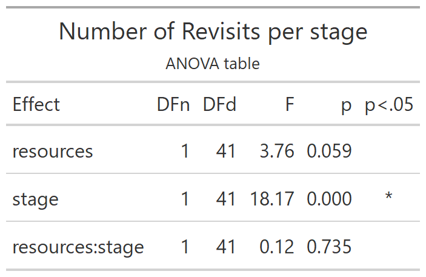

# Number of Revisits Per Trial

Experiment 1

```{r e1_nrevisitspertrial_setup, include=FALSE}
knitr::opts_chunk$set(echo = FALSE)
knitr::opts_chunk$set(fig.path='e1_figures/')
knitr::opts_chunk$set(fig.width=7, fig.height=5)
options(dplyr.summarise.inform=F)
library(tidyverse)
library(ez)
library(gt)

e1 <- readRDS("fgms_e1_allsubs.rds")

e1_nrevisitspertrial <-
  e1 %>%
  transmute(
    pp           = as_factor(pid),
    trial        = trial_in_block, # is 1 to 10 for each condition of "resources"
    resources    = factor(R, levels=c("clumped","random"), labels=c("clumped", "random")),
    stage        = as_factor(ifelse(trial<=5, "early", "late")),
    index        = index,
    tree         = tile,
    is_a_revisit = revisit)

e1_nrevisitspertrial_TRIAL_VALUES <- 
  e1_nrevisitspertrial %>% 
  group_by(pp, resources, stage, trial) %>% 
  summarise(nrevisits = sum(is_a_revisit))

e1_nrevisitspertrial_PARTICIPANT_MEANS <-
  e1_nrevisitspertrial_TRIAL_VALUES %>% 
  group_by(pp, resources, stage) %>% 
  summarise(mean_nrevisits_per_stage = mean(nrevisits))

options(contrasts=c("contr.sum","contr.poly"))
e1_nrevisitspertrial_ANOVA <- 
  ezANOVA(data=e1_nrevisitspertrial_PARTICIPANT_MEANS,
          dv=mean_nrevisits_per_stage,
          wid=pp,
          within=c(resources,stage),
          type=3)

e1_nrevisitspertrial_ANOVA_TABLE <-
  e1_nrevisitspertrial_ANOVA$ANOVA %>% 
  select(-ges) %>% 
  gt() %>% 
  tab_header(
    title="Number of Revisits per stage",
    subtitle = "ANOVA table"
  ) %>% 
  fmt_number(
    columns = c("F"),
    rows=everything(),
    decimals=2
  )  %>% 
  fmt_number(
    columns = c("p"),
    rows=everything(),
    decimals=3
  ) %>% 
  cols_align(
    columns=`p<.05`,
    align="c"
  )
gtsave(e1_nrevisitspertrial_ANOVA_TABLE, "e1_tables/e1_nrevisitspertrial_ANOVA.png")


# Two points along the x axis, each participant contributes one point per cell
e1_nrevisitspertrial_PLOT2 <-
  ggplot(
  data=e1_nrevisitspertrial_PARTICIPANT_MEANS, 
  aes(x=stage, y=mean_nrevisits_per_stage, group=resources, pch=resources, fill=resources)
) +
  theme_bw()+
  theme(aspect.ratio = 1, panel.grid=element_blank())+
  scale_fill_manual(values=c("white", "black")) +
  scale_shape_manual(values=c(24,19)) +
  stat_summary(fun.data = mean_cl_normal, geom = "errorbar", width=0.2, position=position_dodge(0.25)) +
  stat_summary(fun = mean, geom = "line", position=position_dodge(0.25)) + 
  stat_summary(fun = mean, geom = "point", size=3, position=position_dodge(0.25))
ggsave("e1_plots/e1_nrevisitspertrial_PLOT2.png")
```

```{r out.width="50%"}

```

```{r out.width="75%"}
knitr::include_graphics("e1_plots/e1_nrevisitspertrial_PLOT2.png")
```

