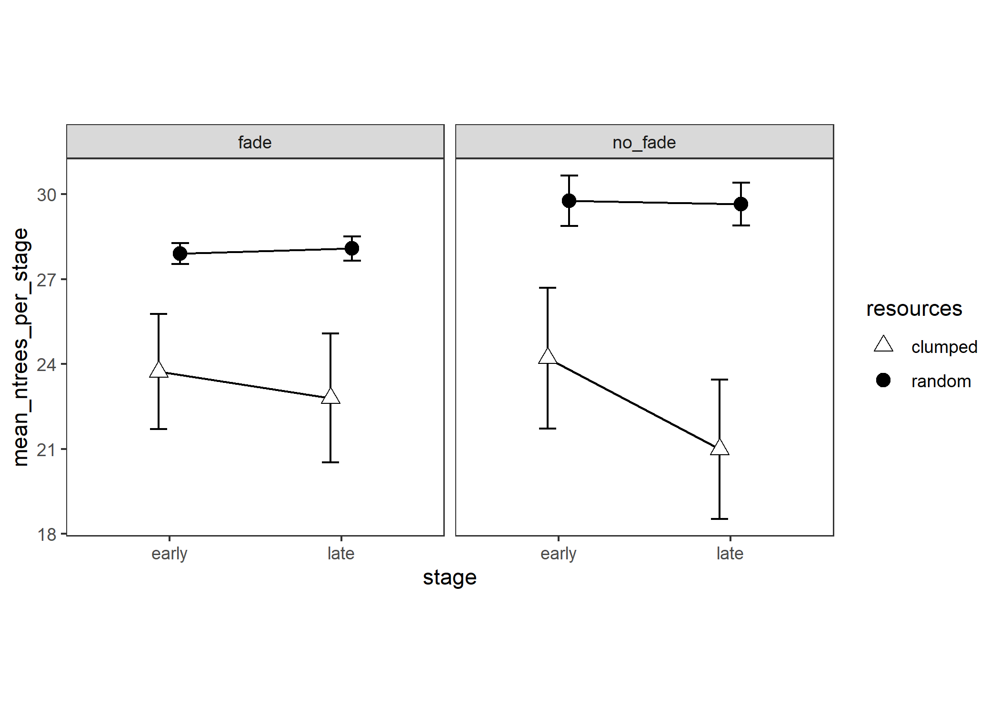

# Number of trees

Experiment 2

```{r e2_ntrees_setup, include=FALSE}
knitr::opts_chunk$set(echo = FALSE)
knitr::opts_chunk$set(fig.path='e2_figures/')
knitr::opts_chunk$set(fig.width=7, fig.height=5)
options(dplyr.summarise.inform=F)
library(tidyverse)
library(ez)
library(gt)

e2 <- readRDS("fgms_e2_allsubs.rds")

e2_ntrees <-
  e2 %>%
  transmute(
    pid          = as_factor(pid),
    trial        = trial_in_block,
    resources    = R,
    fading       = V,
    stage        = as_factor(ifelse(trial_in_block<=10, "early", "late")),
    index        = index,
    tree         = tile)

e2_ntrees_TRIAL_SUMS <- 
  e2_ntrees %>% 
  group_by(pid, resources, stage, fading, trial) %>% 
  summarise(ntrees=n())

e2_ntrees_PARTICIPANT_MEANS <-
  e2_ntrees_TRIAL_SUMS %>% 
  group_by(pid, resources, stage, fading) %>% 
  summarise(mean_ntrees_per_stage = mean(ntrees))

options(contrasts=c("contr.sum","contr.poly"))
e2_ntrees_ANOVA <- 
  ezANOVA(data=e2_ntrees_PARTICIPANT_MEANS,
          dv=mean_ntrees_per_stage,
          wid=pid,
          within=c(resources,stage),
          between=fading,
          type=3)

e2_ntrees_ANOVA_TABLE <-
  e2_ntrees_ANOVA$ANOVA %>% 
  select(-ges) %>% 
  gt() %>% 
  tab_header(
    title="Number of trees",
    subtitle = "ANOVA table"
  ) %>% 
  fmt_number(
    columns = c("F"),
    rows=everything(),
    decimals=2
  )  %>% 
  fmt_number(
    columns = c("p"),
    rows=everything(),
    decimals=3
  ) %>% 
  cols_align(
    columns=`p<.05`,
    align="c"
  )
gtsave(e2_ntrees_ANOVA_TABLE, "e2_tables/e2_ntrees_ANOVA.png")

# Two points along the x axis, each participant contributes one point per cell
e2_ntrees_PLOT2 <-
  ggplot(
  data=e2_ntrees_PARTICIPANT_MEANS, 
  aes(x=stage, y=mean_ntrees_per_stage, group=resources, pch=resources, fill=resources)
) +
  facet_wrap(~fading)+
  theme_bw()+
  theme(aspect.ratio = 1, panel.grid=element_blank())+
  scale_fill_manual(values=c("white", "black")) +
  scale_shape_manual(values=c(24,19)) +
  stat_summary(fun.data = mean_cl_normal, geom = "errorbar", width=0.2, position=position_dodge(0.25)) +
  stat_summary(fun = mean, geom = "line", position=position_dodge(0.25)) + 
  stat_summary(fun = mean, geom = "point", size=3, position=position_dodge(0.25))
ggsave("e2_plots/e2_ntrees_PLOT2.png")
```

```{r out.width="50%"}
knitr::include_graphics("e2_tables/e2_ntrees_ANOVA.png")
```

```{r out.width="100%"}

```

Double checking main effect of fading not being significant. Does an effect have to be stronger to be significant for a between-subjects variable like this (versus a within-subjects effect)?

```{r dcheckntrees, out.width="100%"}
ggplot(data=e2_ntrees_PARTICIPANT_MEANS, aes(y=mean_ntrees_per_stage, x=fading))+
  geom_violin()+geom_jitter(width=0.15)+stat_summary(geom="point",fun="mean",size=6,aes(color=fading))
```

Interaction between stage and fading

```{r, dcheck_ntrees_interaction_stage_x_fading, out.width="100%"}
ggplot(data=e2_ntrees_PARTICIPANT_MEANS %>% group_by(stage,fading,pid) %>% summarise(meanntrees=mean(mean_ntrees_per_stage)),
       aes(x=stage,y=meanntrees,group=stage))+
  facet_wrap(~fading)+
  theme_bw()+
  theme(aspect.ratio = 1, panel.grid=element_blank())+
  scale_fill_manual(values=c("white", "black")) +
  scale_shape_manual(values=c(24,19))+
  stat_summary(fun.data = mean_cl_normal, geom = "errorbar", width=0.2, position=position_dodge(0.25)) +
  stat_summary(fun = mean, geom = "line", position=position_dodge(0.25), aes(group=1)) + 
  stat_summary(fun = mean, geom = "point", size=3, position=position_dodge(0.25))
```

Interaction between stage and resources

```{r, dcheck_ntrees_interaction_stage_x_resources, out.width="100%"}
ggplot(data=e2_ntrees_PARTICIPANT_MEANS %>% group_by(stage,resources,pid) %>% summarise(meanntrees=mean(mean_ntrees_per_stage)),
       aes(x=stage,y=meanntrees,group=stage))+
  facet_wrap(~resources)+
  theme_bw()+
  theme(aspect.ratio = 1, panel.grid=element_blank())+
  scale_fill_manual(values=c("white", "black")) +
  scale_shape_manual(values=c(24,19))+
  stat_summary(fun.data = mean_cl_normal, geom = "errorbar", width=0.2, position=position_dodge(0.25)) +
  stat_summary(fun = mean, geom = "line", position=position_dodge(0.25), aes(group=1)) + 
  stat_summary(fun = mean, geom = "point", size=3, position=position_dodge(0.25))
```

Interaction between resources and fading

```{r dcheck_ntrees_interaction_resources_x_fading, out.width="100%"}
ggplot(data=e2_ntrees_PARTICIPANT_MEANS %>% group_by(resources,fading,pid) %>% summarise(meanntrees=mean(mean_ntrees_per_stage)),
       aes(x=resources,y=meanntrees,group=resources))+
  facet_wrap(~fading)+
  theme_bw()+
  theme(aspect.ratio = 1, panel.grid=element_blank())+
  scale_fill_manual(values=c("white", "black")) +
  scale_shape_manual(values=c(24,19))+
  stat_summary(fun.data = mean_cl_normal, geom = "errorbar", width=0.2, position=position_dodge(0.25)) +
  stat_summary(fun = mean, geom = "line", position=position_dodge(0.25), aes(group=1)) + 
  stat_summary(fun = mean, geom = "point", size=3, position=position_dodge(0.25))
```

