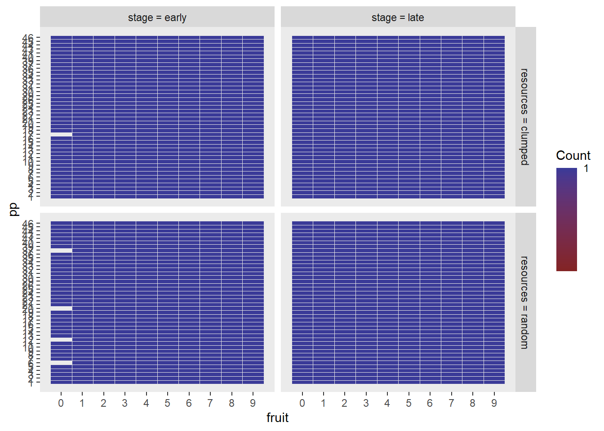

# Number of revisits grand analysis

Experiment 1


# SANITY CHECKS

We have got problems here.

The original analysis' descriptives are wildly different from the ones we are using now. 
For example, the values for revisits x fruit in the original are 0.02 revisits for the first fruit in clumped and 0.005 for random. Our equivalents are 0.2 for clumped and 0.05 for random. We seem to have ten times as many revisits

One possibility is that the code that parses the pickles is creating the raw variable mutate(revisit = as.numeric(duplicated(tile))) differently.

Even within the new analysis, the tabled means don't line up with the plotted means. For example in the plot of resources x stage, the mean for clumped early is about 1.0 and the mean for random early is about 1.2, so the mean for early is about 1.1. However the table of means thinks that the mean for early is 2.06. The tabled mean for late is 1.57 - the plot's mean for late is about 0.8.


## Raw data plots because the calculated means don't line up with the plotted means


a 2 (resource distribution) x 2 (trial stage) x 10 (fruit consumed) analysis

## We reveal the structural missings 


Currently this df has multiple rows for each fruit - we want a single row for each fruit representing the count of revisits for that fruit


Collapse over trials to get means per stage - each participant contributes one value per cell where a cell is 2 (resources) x 2 (stage) x 10 (fruit).


```r
# not run
options(contrasts=c("contr.sum","contr.poly"))
e1_nrevisits_grand_ANOVA<-
  ezANOVA(data=e1_nrevisits_grand_PARTICIPANT_MEANS,
          dv=meanrevisits,
          wid=pp,
          within=c(resources,stage,fruit),
          type=3)
```

That yields:

> Error in ezANOVA_main(data = data, dv = dv, wid = wid, within = within,  : 
  One or more cells is missing data. Try using ezDesign() to check your data.
  


So every time (5 times) participant 17 in clumped; and participants 37, 20, 12, 6 in random saw the first tree in the early stage it was a fruit, leading to no value for number of revisits, which constitutes a structural missing not an NA.

## We replace structural missings with zero counts

We replace structural missings with zero: after all, this is equivalent with saying that they didn't revisit any trees on their way to getting their first fruit, which is a true statement, even if it conceals that fact that they didn't have any _opportunities_ to revisit any trees on the way to getting their first fruit.


## We show that there aren't any structural missings now.


## We do the ANOVA on the augmented data

Ok we can proceed with the ANOVA now.


This is the ANOVA table


----

## Means

### Significant stage effect means

Now we want grand means for the significant stage effect.


```{=html}
<div id="pjojjtqaxa" style="overflow-x:auto;overflow-y:auto;width:auto;height:auto;">
<style>html {
  font-family: -apple-system, BlinkMacSystemFont, 'Segoe UI', Roboto, Oxygen, Ubuntu, Cantarell, 'Helvetica Neue', 'Fira Sans', 'Droid Sans', Arial, sans-serif;
}

#pjojjtqaxa .gt_table {
  display: table;
  border-collapse: collapse;
  margin-left: 0;
  margin-right: auto;
  color: #333333;
  font-size: 16px;
  font-weight: normal;
  font-style: normal;
  background-color: #FFFFFF;
  width: auto;
  border-top-style: solid;
  border-top-width: 2px;
  border-top-color: #A8A8A8;
  border-right-style: none;
  border-right-width: 2px;
  border-right-color: #D3D3D3;
  border-bottom-style: solid;
  border-bottom-width: 2px;
  border-bottom-color: #A8A8A8;
  border-left-style: none;
  border-left-width: 2px;
  border-left-color: #D3D3D3;
}

#pjojjtqaxa .gt_heading {
  background-color: #FFFFFF;
  text-align: center;
  border-bottom-color: #FFFFFF;
  border-left-style: none;
  border-left-width: 1px;
  border-left-color: #D3D3D3;
  border-right-style: none;
  border-right-width: 1px;
  border-right-color: #D3D3D3;
}

#pjojjtqaxa .gt_title {
  color: #333333;
  font-size: 125%;
  font-weight: initial;
  padding-top: 4px;
  padding-bottom: 4px;
  padding-left: 5px;
  padding-right: 5px;
  border-bottom-color: #FFFFFF;
  border-bottom-width: 0;
}

#pjojjtqaxa .gt_subtitle {
  color: #333333;
  font-size: 85%;
  font-weight: initial;
  padding-top: 0;
  padding-bottom: 6px;
  padding-left: 5px;
  padding-right: 5px;
  border-top-color: #FFFFFF;
  border-top-width: 0;
}

#pjojjtqaxa .gt_bottom_border {
  border-bottom-style: solid;
  border-bottom-width: 2px;
  border-bottom-color: #D3D3D3;
}

#pjojjtqaxa .gt_col_headings {
  border-top-style: solid;
  border-top-width: 2px;
  border-top-color: #D3D3D3;
  border-bottom-style: solid;
  border-bottom-width: 2px;
  border-bottom-color: #D3D3D3;
  border-left-style: none;
  border-left-width: 1px;
  border-left-color: #D3D3D3;
  border-right-style: none;
  border-right-width: 1px;
  border-right-color: #D3D3D3;
}

#pjojjtqaxa .gt_col_heading {
  color: #333333;
  background-color: #FFFFFF;
  font-size: 100%;
  font-weight: normal;
  text-transform: inherit;
  border-left-style: none;
  border-left-width: 1px;
  border-left-color: #D3D3D3;
  border-right-style: none;
  border-right-width: 1px;
  border-right-color: #D3D3D3;
  vertical-align: bottom;
  padding-top: 5px;
  padding-bottom: 6px;
  padding-left: 5px;
  padding-right: 5px;
  overflow-x: hidden;
}

#pjojjtqaxa .gt_column_spanner_outer {
  color: #333333;
  background-color: #FFFFFF;
  font-size: 100%;
  font-weight: normal;
  text-transform: inherit;
  padding-top: 0;
  padding-bottom: 0;
  padding-left: 4px;
  padding-right: 4px;
}

#pjojjtqaxa .gt_column_spanner_outer:first-child {
  padding-left: 0;
}

#pjojjtqaxa .gt_column_spanner_outer:last-child {
  padding-right: 0;
}

#pjojjtqaxa .gt_column_spanner {
  border-bottom-style: solid;
  border-bottom-width: 2px;
  border-bottom-color: #D3D3D3;
  vertical-align: bottom;
  padding-top: 5px;
  padding-bottom: 5px;
  overflow-x: hidden;
  display: inline-block;
  width: 100%;
}

#pjojjtqaxa .gt_group_heading {
  padding-top: 8px;
  padding-bottom: 8px;
  padding-left: 5px;
  padding-right: 5px;
  color: #333333;
  background-color: #FFFFFF;
  font-size: 100%;
  font-weight: initial;
  text-transform: inherit;
  border-top-style: solid;
  border-top-width: 2px;
  border-top-color: #D3D3D3;
  border-bottom-style: solid;
  border-bottom-width: 2px;
  border-bottom-color: #D3D3D3;
  border-left-style: none;
  border-left-width: 1px;
  border-left-color: #D3D3D3;
  border-right-style: none;
  border-right-width: 1px;
  border-right-color: #D3D3D3;
  vertical-align: middle;
}

#pjojjtqaxa .gt_empty_group_heading {
  padding: 0.5px;
  color: #333333;
  background-color: #FFFFFF;
  font-size: 100%;
  font-weight: initial;
  border-top-style: solid;
  border-top-width: 2px;
  border-top-color: #D3D3D3;
  border-bottom-style: solid;
  border-bottom-width: 2px;
  border-bottom-color: #D3D3D3;
  vertical-align: middle;
}

#pjojjtqaxa .gt_from_md > :first-child {
  margin-top: 0;
}

#pjojjtqaxa .gt_from_md > :last-child {
  margin-bottom: 0;
}

#pjojjtqaxa .gt_row {
  padding-top: 8px;
  padding-bottom: 8px;
  padding-left: 5px;
  padding-right: 5px;
  margin: 10px;
  border-top-style: solid;
  border-top-width: 1px;
  border-top-color: #D3D3D3;
  border-left-style: none;
  border-left-width: 1px;
  border-left-color: #D3D3D3;
  border-right-style: none;
  border-right-width: 1px;
  border-right-color: #D3D3D3;
  vertical-align: middle;
  overflow-x: hidden;
}

#pjojjtqaxa .gt_stub {
  color: #333333;
  background-color: #FFFFFF;
  font-size: 100%;
  font-weight: initial;
  text-transform: inherit;
  border-right-style: solid;
  border-right-width: 2px;
  border-right-color: #D3D3D3;
  padding-left: 5px;
  padding-right: 5px;
}

#pjojjtqaxa .gt_stub_row_group {
  color: #333333;
  background-color: #FFFFFF;
  font-size: 100%;
  font-weight: initial;
  text-transform: inherit;
  border-right-style: solid;
  border-right-width: 2px;
  border-right-color: #D3D3D3;
  padding-left: 5px;
  padding-right: 5px;
  vertical-align: top;
}

#pjojjtqaxa .gt_row_group_first td {
  border-top-width: 2px;
}

#pjojjtqaxa .gt_summary_row {
  color: #333333;
  background-color: #FFFFFF;
  text-transform: inherit;
  padding-top: 8px;
  padding-bottom: 8px;
  padding-left: 5px;
  padding-right: 5px;
}

#pjojjtqaxa .gt_first_summary_row {
  border-top-style: solid;
  border-top-color: #D3D3D3;
}

#pjojjtqaxa .gt_first_summary_row.thick {
  border-top-width: 2px;
}

#pjojjtqaxa .gt_last_summary_row {
  padding-top: 8px;
  padding-bottom: 8px;
  padding-left: 5px;
  padding-right: 5px;
  border-bottom-style: solid;
  border-bottom-width: 2px;
  border-bottom-color: #D3D3D3;
}

#pjojjtqaxa .gt_grand_summary_row {
  color: #333333;
  background-color: #FFFFFF;
  text-transform: inherit;
  padding-top: 8px;
  padding-bottom: 8px;
  padding-left: 5px;
  padding-right: 5px;
}

#pjojjtqaxa .gt_first_grand_summary_row {
  padding-top: 8px;
  padding-bottom: 8px;
  padding-left: 5px;
  padding-right: 5px;
  border-top-style: double;
  border-top-width: 6px;
  border-top-color: #D3D3D3;
}

#pjojjtqaxa .gt_striped {
  background-color: rgba(128, 128, 128, 0.05);
}

#pjojjtqaxa .gt_table_body {
  border-top-style: solid;
  border-top-width: 2px;
  border-top-color: #D3D3D3;
  border-bottom-style: solid;
  border-bottom-width: 2px;
  border-bottom-color: #D3D3D3;
}

#pjojjtqaxa .gt_footnotes {
  color: #333333;
  background-color: #FFFFFF;
  border-bottom-style: none;
  border-bottom-width: 2px;
  border-bottom-color: #D3D3D3;
  border-left-style: none;
  border-left-width: 2px;
  border-left-color: #D3D3D3;
  border-right-style: none;
  border-right-width: 2px;
  border-right-color: #D3D3D3;
}

#pjojjtqaxa .gt_footnote {
  margin: 0px;
  font-size: 90%;
  padding-left: 4px;
  padding-right: 4px;
  padding-left: 5px;
  padding-right: 5px;
}

#pjojjtqaxa .gt_sourcenotes {
  color: #333333;
  background-color: #FFFFFF;
  border-bottom-style: none;
  border-bottom-width: 2px;
  border-bottom-color: #D3D3D3;
  border-left-style: none;
  border-left-width: 2px;
  border-left-color: #D3D3D3;
  border-right-style: none;
  border-right-width: 2px;
  border-right-color: #D3D3D3;
}

#pjojjtqaxa .gt_sourcenote {
  font-size: 90%;
  padding-top: 4px;
  padding-bottom: 4px;
  padding-left: 5px;
  padding-right: 5px;
}

#pjojjtqaxa .gt_left {
  text-align: left;
}

#pjojjtqaxa .gt_center {
  text-align: center;
}

#pjojjtqaxa .gt_right {
  text-align: right;
  font-variant-numeric: tabular-nums;
}

#pjojjtqaxa .gt_font_normal {
  font-weight: normal;
}

#pjojjtqaxa .gt_font_bold {
  font-weight: bold;
}

#pjojjtqaxa .gt_font_italic {
  font-style: italic;
}

#pjojjtqaxa .gt_super {
  font-size: 65%;
}

#pjojjtqaxa .gt_two_val_uncert {
  display: inline-block;
  line-height: 1em;
  text-align: right;
  font-size: 60%;
  vertical-align: -0.25em;
  margin-left: 0.1em;
}

#pjojjtqaxa .gt_footnote_marks {
  font-style: italic;
  font-weight: normal;
  font-size: 75%;
  vertical-align: 0.4em;
}

#pjojjtqaxa .gt_asterisk {
  font-size: 100%;
  vertical-align: 0;
}

#pjojjtqaxa .gt_slash_mark {
  font-size: 0.7em;
  line-height: 0.7em;
  vertical-align: 0.15em;
}

#pjojjtqaxa .gt_fraction_numerator {
  font-size: 0.6em;
  line-height: 0.6em;
  vertical-align: 0.45em;
}

#pjojjtqaxa .gt_fraction_denominator {
  font-size: 0.6em;
  line-height: 0.6em;
  vertical-align: -0.05em;
}
</style>
<table class="gt_table">
  
  <thead class="gt_col_headings">
    <tr>
      <th class="gt_col_heading gt_columns_bottom_border gt_center" rowspan="1" colspan="1">stage</th>
      <th class="gt_col_heading gt_columns_bottom_border gt_right" rowspan="1" colspan="1">mean</th>
      <th class="gt_col_heading gt_columns_bottom_border gt_right" rowspan="1" colspan="1">sd</th>
    </tr>
  </thead>
  <tbody class="gt_table_body">
    <tr><td class="gt_row gt_center">early</td>
<td class="gt_row gt_right">2.06</td>
<td class="gt_row gt_right">1.51</td></tr>
    <tr><td class="gt_row gt_center">late</td>
<td class="gt_row gt_right">1.57</td>
<td class="gt_row gt_right">1.44</td></tr>
  </tbody>
  
  
</table>
</div>
```


### Significant fruit effect means

We report the first and tenth value


```{=html}
<div id="lddvtpemun" style="overflow-x:auto;overflow-y:auto;width:auto;height:auto;">
<style>html {
  font-family: -apple-system, BlinkMacSystemFont, 'Segoe UI', Roboto, Oxygen, Ubuntu, Cantarell, 'Helvetica Neue', 'Fira Sans', 'Droid Sans', Arial, sans-serif;
}

#lddvtpemun .gt_table {
  display: table;
  border-collapse: collapse;
  margin-left: 0;
  margin-right: auto;
  color: #333333;
  font-size: 16px;
  font-weight: normal;
  font-style: normal;
  background-color: #FFFFFF;
  width: auto;
  border-top-style: solid;
  border-top-width: 2px;
  border-top-color: #A8A8A8;
  border-right-style: none;
  border-right-width: 2px;
  border-right-color: #D3D3D3;
  border-bottom-style: solid;
  border-bottom-width: 2px;
  border-bottom-color: #A8A8A8;
  border-left-style: none;
  border-left-width: 2px;
  border-left-color: #D3D3D3;
}

#lddvtpemun .gt_heading {
  background-color: #FFFFFF;
  text-align: center;
  border-bottom-color: #FFFFFF;
  border-left-style: none;
  border-left-width: 1px;
  border-left-color: #D3D3D3;
  border-right-style: none;
  border-right-width: 1px;
  border-right-color: #D3D3D3;
}

#lddvtpemun .gt_title {
  color: #333333;
  font-size: 125%;
  font-weight: initial;
  padding-top: 4px;
  padding-bottom: 4px;
  padding-left: 5px;
  padding-right: 5px;
  border-bottom-color: #FFFFFF;
  border-bottom-width: 0;
}

#lddvtpemun .gt_subtitle {
  color: #333333;
  font-size: 85%;
  font-weight: initial;
  padding-top: 0;
  padding-bottom: 6px;
  padding-left: 5px;
  padding-right: 5px;
  border-top-color: #FFFFFF;
  border-top-width: 0;
}

#lddvtpemun .gt_bottom_border {
  border-bottom-style: solid;
  border-bottom-width: 2px;
  border-bottom-color: #D3D3D3;
}

#lddvtpemun .gt_col_headings {
  border-top-style: solid;
  border-top-width: 2px;
  border-top-color: #D3D3D3;
  border-bottom-style: solid;
  border-bottom-width: 2px;
  border-bottom-color: #D3D3D3;
  border-left-style: none;
  border-left-width: 1px;
  border-left-color: #D3D3D3;
  border-right-style: none;
  border-right-width: 1px;
  border-right-color: #D3D3D3;
}

#lddvtpemun .gt_col_heading {
  color: #333333;
  background-color: #FFFFFF;
  font-size: 100%;
  font-weight: normal;
  text-transform: inherit;
  border-left-style: none;
  border-left-width: 1px;
  border-left-color: #D3D3D3;
  border-right-style: none;
  border-right-width: 1px;
  border-right-color: #D3D3D3;
  vertical-align: bottom;
  padding-top: 5px;
  padding-bottom: 6px;
  padding-left: 5px;
  padding-right: 5px;
  overflow-x: hidden;
}

#lddvtpemun .gt_column_spanner_outer {
  color: #333333;
  background-color: #FFFFFF;
  font-size: 100%;
  font-weight: normal;
  text-transform: inherit;
  padding-top: 0;
  padding-bottom: 0;
  padding-left: 4px;
  padding-right: 4px;
}

#lddvtpemun .gt_column_spanner_outer:first-child {
  padding-left: 0;
}

#lddvtpemun .gt_column_spanner_outer:last-child {
  padding-right: 0;
}

#lddvtpemun .gt_column_spanner {
  border-bottom-style: solid;
  border-bottom-width: 2px;
  border-bottom-color: #D3D3D3;
  vertical-align: bottom;
  padding-top: 5px;
  padding-bottom: 5px;
  overflow-x: hidden;
  display: inline-block;
  width: 100%;
}

#lddvtpemun .gt_group_heading {
  padding-top: 8px;
  padding-bottom: 8px;
  padding-left: 5px;
  padding-right: 5px;
  color: #333333;
  background-color: #FFFFFF;
  font-size: 100%;
  font-weight: initial;
  text-transform: inherit;
  border-top-style: solid;
  border-top-width: 2px;
  border-top-color: #D3D3D3;
  border-bottom-style: solid;
  border-bottom-width: 2px;
  border-bottom-color: #D3D3D3;
  border-left-style: none;
  border-left-width: 1px;
  border-left-color: #D3D3D3;
  border-right-style: none;
  border-right-width: 1px;
  border-right-color: #D3D3D3;
  vertical-align: middle;
}

#lddvtpemun .gt_empty_group_heading {
  padding: 0.5px;
  color: #333333;
  background-color: #FFFFFF;
  font-size: 100%;
  font-weight: initial;
  border-top-style: solid;
  border-top-width: 2px;
  border-top-color: #D3D3D3;
  border-bottom-style: solid;
  border-bottom-width: 2px;
  border-bottom-color: #D3D3D3;
  vertical-align: middle;
}

#lddvtpemun .gt_from_md > :first-child {
  margin-top: 0;
}

#lddvtpemun .gt_from_md > :last-child {
  margin-bottom: 0;
}

#lddvtpemun .gt_row {
  padding-top: 8px;
  padding-bottom: 8px;
  padding-left: 5px;
  padding-right: 5px;
  margin: 10px;
  border-top-style: solid;
  border-top-width: 1px;
  border-top-color: #D3D3D3;
  border-left-style: none;
  border-left-width: 1px;
  border-left-color: #D3D3D3;
  border-right-style: none;
  border-right-width: 1px;
  border-right-color: #D3D3D3;
  vertical-align: middle;
  overflow-x: hidden;
}

#lddvtpemun .gt_stub {
  color: #333333;
  background-color: #FFFFFF;
  font-size: 100%;
  font-weight: initial;
  text-transform: inherit;
  border-right-style: solid;
  border-right-width: 2px;
  border-right-color: #D3D3D3;
  padding-left: 5px;
  padding-right: 5px;
}

#lddvtpemun .gt_stub_row_group {
  color: #333333;
  background-color: #FFFFFF;
  font-size: 100%;
  font-weight: initial;
  text-transform: inherit;
  border-right-style: solid;
  border-right-width: 2px;
  border-right-color: #D3D3D3;
  padding-left: 5px;
  padding-right: 5px;
  vertical-align: top;
}

#lddvtpemun .gt_row_group_first td {
  border-top-width: 2px;
}

#lddvtpemun .gt_summary_row {
  color: #333333;
  background-color: #FFFFFF;
  text-transform: inherit;
  padding-top: 8px;
  padding-bottom: 8px;
  padding-left: 5px;
  padding-right: 5px;
}

#lddvtpemun .gt_first_summary_row {
  border-top-style: solid;
  border-top-color: #D3D3D3;
}

#lddvtpemun .gt_first_summary_row.thick {
  border-top-width: 2px;
}

#lddvtpemun .gt_last_summary_row {
  padding-top: 8px;
  padding-bottom: 8px;
  padding-left: 5px;
  padding-right: 5px;
  border-bottom-style: solid;
  border-bottom-width: 2px;
  border-bottom-color: #D3D3D3;
}

#lddvtpemun .gt_grand_summary_row {
  color: #333333;
  background-color: #FFFFFF;
  text-transform: inherit;
  padding-top: 8px;
  padding-bottom: 8px;
  padding-left: 5px;
  padding-right: 5px;
}

#lddvtpemun .gt_first_grand_summary_row {
  padding-top: 8px;
  padding-bottom: 8px;
  padding-left: 5px;
  padding-right: 5px;
  border-top-style: double;
  border-top-width: 6px;
  border-top-color: #D3D3D3;
}

#lddvtpemun .gt_striped {
  background-color: rgba(128, 128, 128, 0.05);
}

#lddvtpemun .gt_table_body {
  border-top-style: solid;
  border-top-width: 2px;
  border-top-color: #D3D3D3;
  border-bottom-style: solid;
  border-bottom-width: 2px;
  border-bottom-color: #D3D3D3;
}

#lddvtpemun .gt_footnotes {
  color: #333333;
  background-color: #FFFFFF;
  border-bottom-style: none;
  border-bottom-width: 2px;
  border-bottom-color: #D3D3D3;
  border-left-style: none;
  border-left-width: 2px;
  border-left-color: #D3D3D3;
  border-right-style: none;
  border-right-width: 2px;
  border-right-color: #D3D3D3;
}

#lddvtpemun .gt_footnote {
  margin: 0px;
  font-size: 90%;
  padding-left: 4px;
  padding-right: 4px;
  padding-left: 5px;
  padding-right: 5px;
}

#lddvtpemun .gt_sourcenotes {
  color: #333333;
  background-color: #FFFFFF;
  border-bottom-style: none;
  border-bottom-width: 2px;
  border-bottom-color: #D3D3D3;
  border-left-style: none;
  border-left-width: 2px;
  border-left-color: #D3D3D3;
  border-right-style: none;
  border-right-width: 2px;
  border-right-color: #D3D3D3;
}

#lddvtpemun .gt_sourcenote {
  font-size: 90%;
  padding-top: 4px;
  padding-bottom: 4px;
  padding-left: 5px;
  padding-right: 5px;
}

#lddvtpemun .gt_left {
  text-align: left;
}

#lddvtpemun .gt_center {
  text-align: center;
}

#lddvtpemun .gt_right {
  text-align: right;
  font-variant-numeric: tabular-nums;
}

#lddvtpemun .gt_font_normal {
  font-weight: normal;
}

#lddvtpemun .gt_font_bold {
  font-weight: bold;
}

#lddvtpemun .gt_font_italic {
  font-style: italic;
}

#lddvtpemun .gt_super {
  font-size: 65%;
}

#lddvtpemun .gt_two_val_uncert {
  display: inline-block;
  line-height: 1em;
  text-align: right;
  font-size: 60%;
  vertical-align: -0.25em;
  margin-left: 0.1em;
}

#lddvtpemun .gt_footnote_marks {
  font-style: italic;
  font-weight: normal;
  font-size: 75%;
  vertical-align: 0.4em;
}

#lddvtpemun .gt_asterisk {
  font-size: 100%;
  vertical-align: 0;
}

#lddvtpemun .gt_slash_mark {
  font-size: 0.7em;
  line-height: 0.7em;
  vertical-align: 0.15em;
}

#lddvtpemun .gt_fraction_numerator {
  font-size: 0.6em;
  line-height: 0.6em;
  vertical-align: 0.45em;
}

#lddvtpemun .gt_fraction_denominator {
  font-size: 0.6em;
  line-height: 0.6em;
  vertical-align: -0.05em;
}
</style>
<table class="gt_table">
  
  <thead class="gt_col_headings">
    <tr>
      <th class="gt_col_heading gt_columns_bottom_border gt_center" rowspan="1" colspan="1">fruit</th>
      <th class="gt_col_heading gt_columns_bottom_border gt_right" rowspan="1" colspan="1">mean</th>
      <th class="gt_col_heading gt_columns_bottom_border gt_right" rowspan="1" colspan="1">sd</th>
    </tr>
  </thead>
  <tbody class="gt_table_body">
    <tr><td class="gt_row gt_center">0</td>
<td class="gt_row gt_right">0.16</td>
<td class="gt_row gt_right">0.18</td></tr>
    <tr><td class="gt_row gt_center">1</td>
<td class="gt_row gt_right">0.22</td>
<td class="gt_row gt_right">0.28</td></tr>
    <tr><td class="gt_row gt_center">2</td>
<td class="gt_row gt_right">0.15</td>
<td class="gt_row gt_right">0.21</td></tr>
    <tr><td class="gt_row gt_center">3</td>
<td class="gt_row gt_right">0.11</td>
<td class="gt_row gt_right">0.18</td></tr>
    <tr><td class="gt_row gt_center">4</td>
<td class="gt_row gt_right">0.15</td>
<td class="gt_row gt_right">0.17</td></tr>
    <tr><td class="gt_row gt_center">5</td>
<td class="gt_row gt_right">0.17</td>
<td class="gt_row gt_right">0.20</td></tr>
    <tr><td class="gt_row gt_center">6</td>
<td class="gt_row gt_right">0.15</td>
<td class="gt_row gt_right">0.18</td></tr>
    <tr><td class="gt_row gt_center">7</td>
<td class="gt_row gt_right">0.15</td>
<td class="gt_row gt_right">0.16</td></tr>
    <tr><td class="gt_row gt_center">8</td>
<td class="gt_row gt_right">0.24</td>
<td class="gt_row gt_right">0.29</td></tr>
    <tr><td class="gt_row gt_center">9</td>
<td class="gt_row gt_right">0.36</td>
<td class="gt_row gt_right">0.41</td></tr>
  </tbody>
  
  
</table>
</div>
```

The average number of revisits made while searching for the first fruit item was 
0.16 +/- 0.18. 
The average number of revisits made while searching for the last fruit item was 
0.36 +/- 0.41. 

----

## Interaction plots

### Stage x Resources

We write code for the plot of the stage x resources interaction. The stage effect is significant but the interaction isn't.


----


### Resources x Fruit interaction (SIG)

Now averaging over stage to give a plot of the (significant) resources X fruit interaction: we will use this in the paper


----


### 3-way stage x fruit x resources

We write code for the stage x fruit x resources interaction. This 3-way interaction is not sig so we don't use this plot - instead we separately plot the significant 2-way resource x fruit collapsing over resources.


