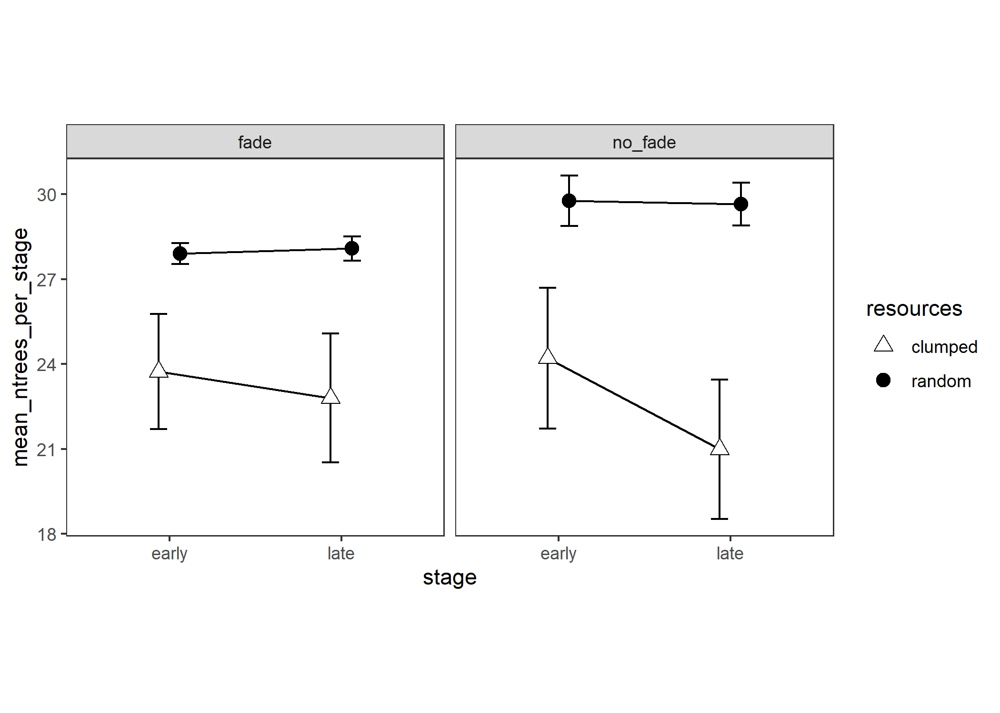
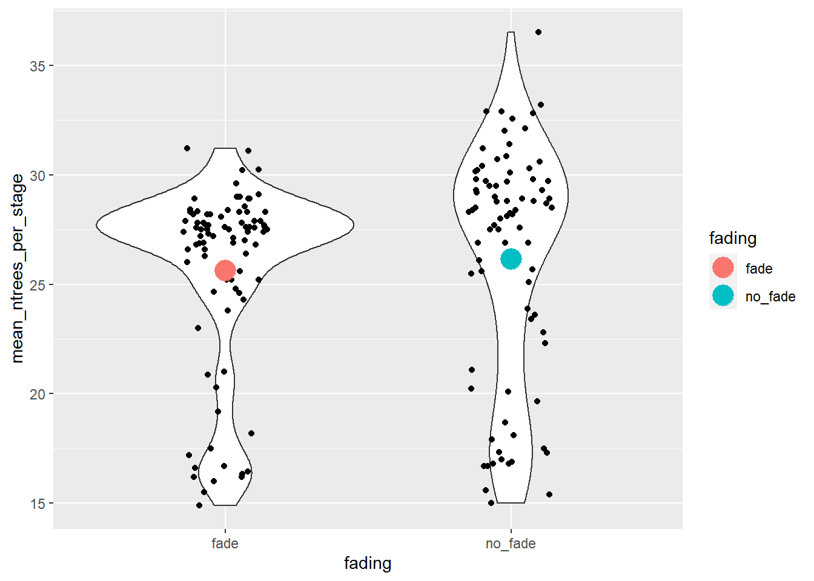
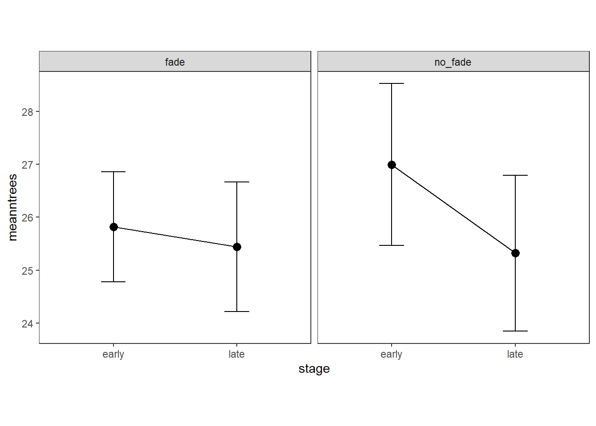
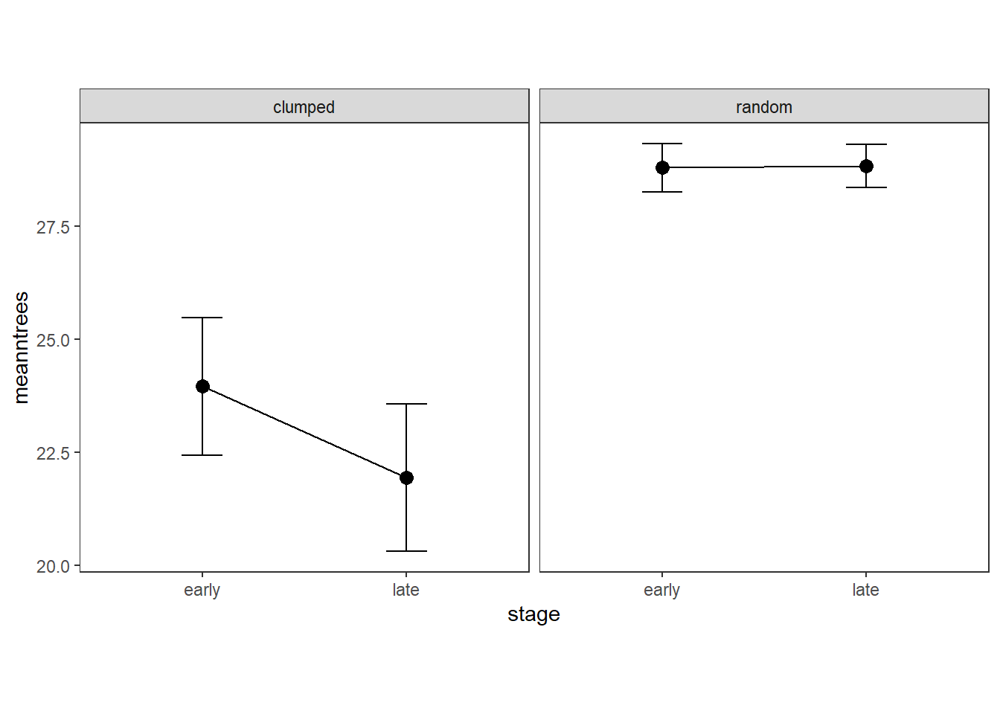
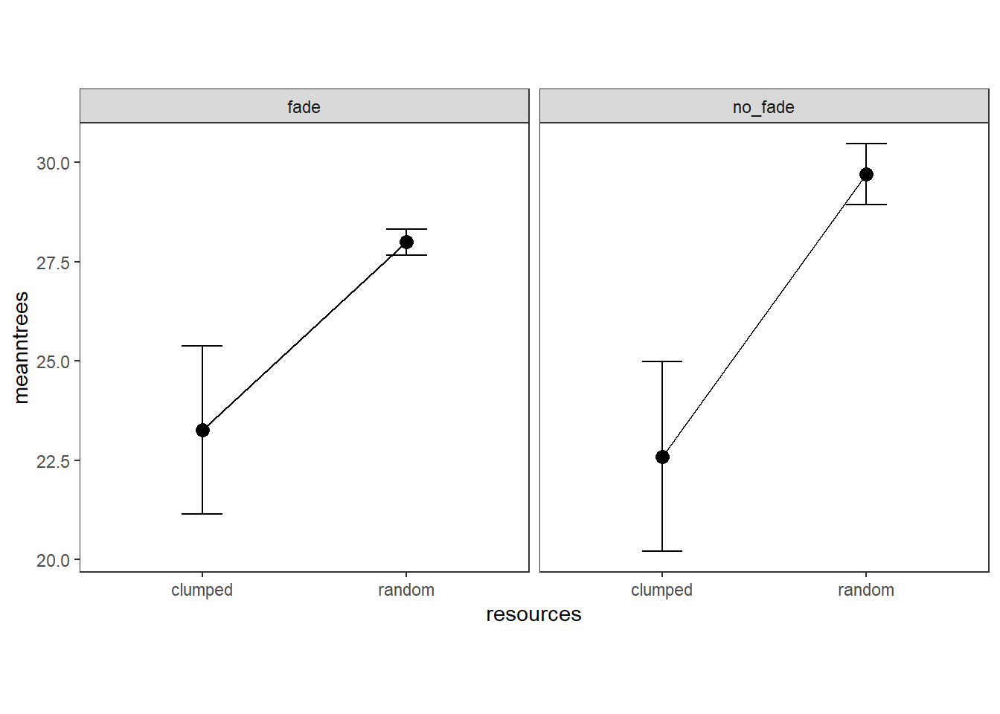

# Number of trees

Experiment 2

Double checking main effect of fading not being significant. Does an effect have to be stronger to be significant for a between-subjects variable like this (versus a within-subjects effect)?

Interaction between stage and fading

Interaction between stage and resources

Interaction between resources and fading

