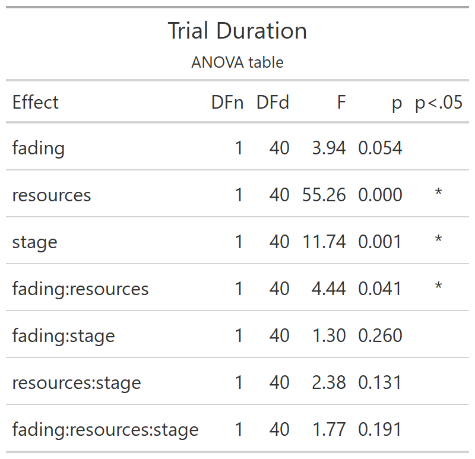
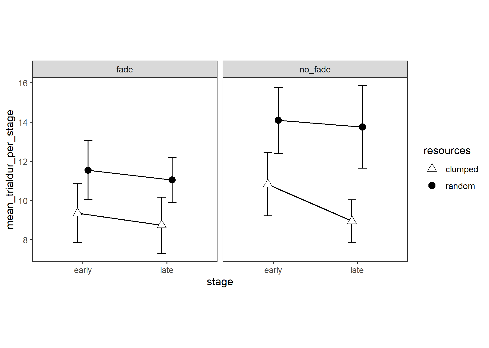
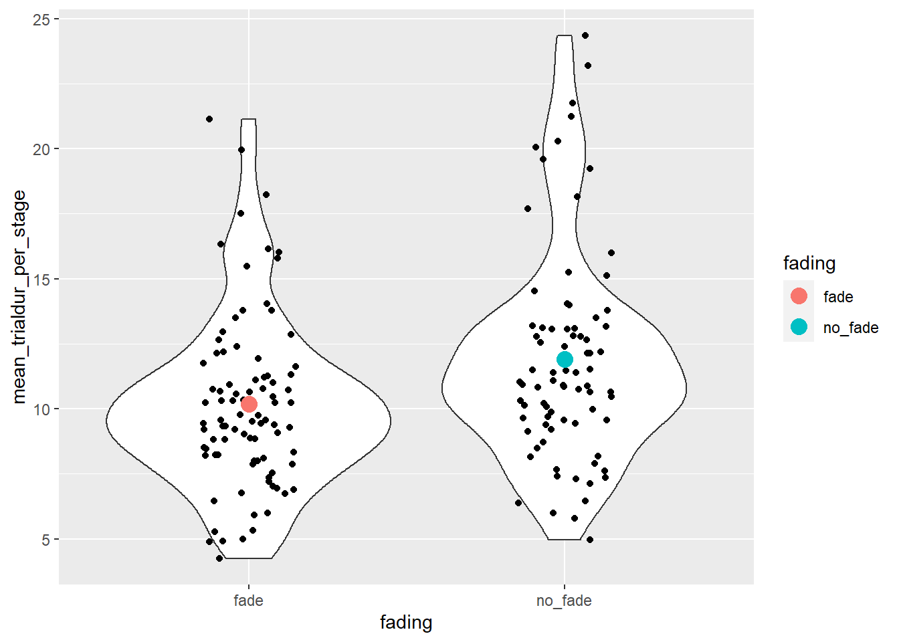

# Trial Duration

Experiment 2

Double checking main effect of fading not being significant (p=0.054 is very nearly sig though). Does an effect have to be stronger to be significant for a between-subjects variable like this (versus a within-subjects effect)?

