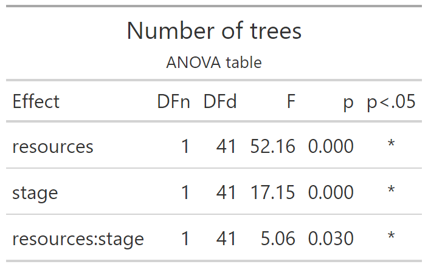
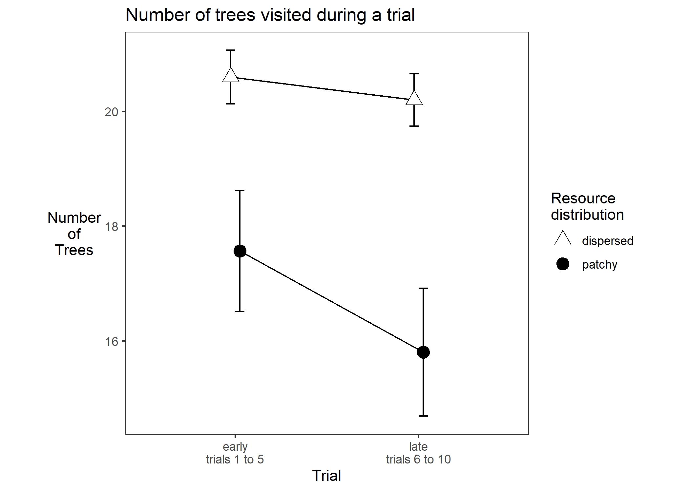

# Number of trees

Experiment 1

```{r e1_ntrees_setup, include=FALSE}
knitr::opts_chunk$set(echo = FALSE)
knitr::opts_chunk$set(fig.path='e1_figures/')
knitr::opts_chunk$set(fig.width=7, fig.height=5)
options(dplyr.summarise.inform=F)
library(tidyverse)
library(ez)
library(gt)

e1 <- readRDS("001-00-e1-data.RDS")

# remove things from the raw data to make it suitable for this particular analysis

# remove samples that did not look at a tree
e1 <- e1 %>% 
  filter(fl>0)

# remove the second (and any subsequent) *consecutive* duplicates
e1 <- e1 %>% 
  filter(is.na(tl != lag(tl)) | tl != lag(tl))

# remove trials where they failed to get 10 fruit
e1 <- e1 %>% 
  group_by(pp, te) %>% 
  mutate(max_fr = max(fr)) %>% 
  ungroup() %>% 
  filter(max_fr==10)

e1_ntrees <-
  e1 %>%
  transmute(
    pp           = as_factor(pp),
    trial        = tb, # is 1 to 10 for each condition of "resources"
    resources    = factor(rr, levels=c("dispersed", "patchy"), labels=c("dispersed", "patchy")),
    stage        = as_factor(ifelse(tb<=5, "early", "late")),
    index        = ix,
    tree         = tl)

e1_ntrees_TRIAL_SUMS <- 
  e1_ntrees %>% 
  group_by(pp, resources, stage, trial) %>% 
  summarise(ntrees=n())

e1_ntrees_PARTICIPANT_MEANS <-
  e1_ntrees_TRIAL_SUMS %>% 
  group_by(pp, resources, stage) %>% 
  summarise(mean_ntrees_per_stage = mean(ntrees))

options(contrasts=c("contr.sum","contr.poly"))
e1_ntrees_ANOVA <- 
  ezANOVA(data=e1_ntrees_PARTICIPANT_MEANS,
          dv=mean_ntrees_per_stage,
          wid=pp,
          within=c(resources,stage),
          type=3)

e1_ntrees_ANOVA_TABLE <-
  e1_ntrees_ANOVA$ANOVA %>% 
  select(-ges) %>% 
  gt() %>% 
  tab_header(
    title="Number of trees",
    subtitle = "ANOVA table"
  ) %>% 
  fmt_number(
    columns = c("F"),
    rows=everything(),
    decimals=2
  )  %>% 
  fmt_number(
    columns = c("p"),
    rows=everything(),
    decimals=3
  ) %>% 
  cols_align(
    columns=`p<.05`,
    align="center"
  )
gtsave(e1_ntrees_ANOVA_TABLE, "e1_tables/e1_ntrees_ANOVA.png")

# Two points along the x axis, each participant contributes one point per cell
pd <- position_dodge(0.1)
e1_ntrees_PLOT2 <-
  ggplot(data=e1_ntrees_PARTICIPANT_MEANS, aes(x=stage, y=mean_ntrees_per_stage, group=resources, pch=resources, fill=resources)
) +
  theme_bw()+
  theme(aspect.ratio = 1, panel.grid=element_blank(), axis.title.y=element_text(angle=0,vjust=0.5,hjust=0.5))+
  scale_fill_manual(name="Resource\ndistribution",values=c("white", "black")) +
  scale_shape_manual(name="Resource\ndistribution",values=c(24,19)) +
  stat_summary(fun.data = mean_cl_normal, geom = "errorbar", width=0.1, position=pd) +
  stat_summary(fun = mean, geom = "line", position=pd) + 
  stat_summary(fun = mean, geom = "point", size=4, position=pd)+
  ggtitle("Number of trees visited during a trial")+
  ylab("Number\nof\nTrees")+
  xlab("Trial")+
  scale_x_discrete(labels=c("early\ntrials 1 to 5", "late\ntrials 6 to 10"))
ggsave("e1_plots/e1_ntrees_PLOT2.png")
```

```{r out.width="50%"}

```

```{r out.width="75%"}

```

----

Here we put tables of means for the significant effects.

```{r}
# The way we do these means and sds is first aggregate over trials so that each pp contributes one mean value for each condition. Then we take the mean of those means, and the sd of those means separately for each cell 
e1_ntrees_TRIAL_SUMS %>%
  ungroup() %>% 
  select(c(resources,pp,ntrees)) %>% 
  group_by(resources,pp) %>% 
  summarise(ppXconditionMean=mean(ntrees)) %>% 
  summarise(mean=mean(ppXconditionMean), sd=sd(ppXconditionMean)) %>% 
  gt() %>% fmt_number(c(2,3), everything(), 2) %>% tab_options(table.align='left')
```

-----

```{r}
e1_ntrees_TRIAL_SUMS %>%
  ungroup() %>% 
  select(c(stage,pp,ntrees)) %>% 
  group_by(stage,pp) %>% 
  summarise(ppXconditionMean=mean(ntrees)) %>% 
  summarise(mean=mean(ppXconditionMean), sd=sd(ppXconditionMean)) %>% 
  gt() %>% fmt_number(c(2,3), everything(), 2) %>% tab_options(table.align='left')
```

