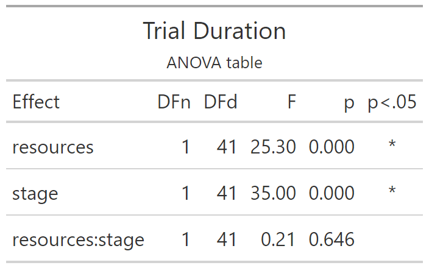
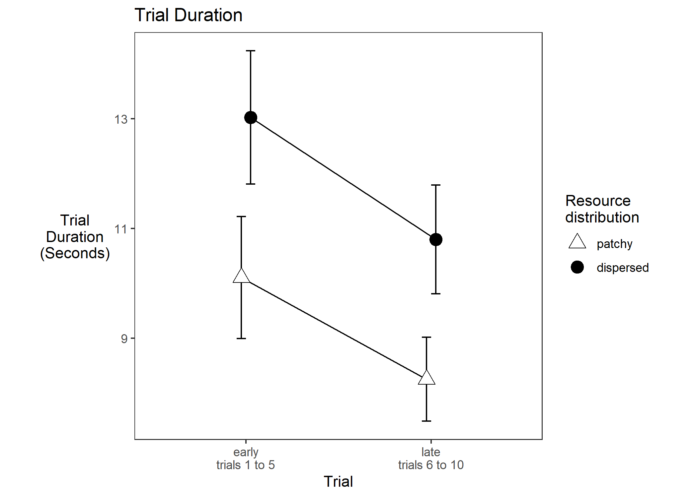

# Trial Duration

Experiment 1

```{r e1_duration_setup, include=FALSE}
knitr::opts_chunk$set(echo = FALSE)
knitr::opts_chunk$set(fig.path='e1_figures/')
knitr::opts_chunk$set(fig.width=7, fig.height=5)
options(dplyr.summarise.inform=F)
library(tidyverse)
library(ez)
library(gt)

e1 <- readRDS("001-00-e1-data.RDS")

e1_duration <-
  e1 %>%
  transmute(
    pp           = as_factor(pp),
    trial        = as.numeric(tb), # is 1 to 10 for each condition of "resources"
    resources    = factor(rr, levels=c("patchy","dispersed"), labels=c("patchy", "dispersed")),
    stage        = as_factor(ifelse(trial<=5, "early", "late")),
    index        = ix,
    tree         = tl,
    tm = tm)

e1_duration <- e1_duration %>% 
  group_by(pp, trial, resources) %>% 
  mutate(dur=max(tm)-min(tm))

e1_duration_TRIAL_VALUES <- 
  e1_duration %>% 
  group_by(pp, resources, stage, trial) %>% 
  summarise(duration = unique(dur))

e1_duration_PARTICIPANT_MEANS <-
  e1_duration_TRIAL_VALUES %>% 
  group_by(pp, resources, stage) %>% 
  summarise(mean_duration_per_stage = mean(duration))


options(contrasts=c("contr.sum","contr.poly"))
e1_duration_ANOVA <- 
  ezANOVA(data=e1_duration_PARTICIPANT_MEANS,
          dv=mean_duration_per_stage,
          wid=pp,
          within=c(resources,stage),
          type=3)

e1_duration_ANOVA_TABLE <-
  e1_duration_ANOVA$ANOVA %>% 
  select(-ges) %>% 
  gt() %>% 
  tab_header(
    title="Trial Duration",
    subtitle = "ANOVA table"
  ) %>% 
  fmt_number(
    columns = c("F"),
    rows=everything(),
    decimals=2
  )  %>% 
  fmt_number(
    columns = c("p"),
    rows=everything(),
    decimals=3
  ) %>% 
  cols_align(
    columns=`p<.05`,
    align="center"
  )
gtsave(e1_duration_ANOVA_TABLE, "e1_tables/e1_duration_ANOVA.png")


# Two points along the x axis, each participant contributes one point per cell

pd <- position_dodge(0.1)
e1_duration_PLOT2 <-
  ggplot(data=e1_duration_PARTICIPANT_MEANS, aes(x=stage, y=mean_duration_per_stage, group=resources, pch=resources, fill=resources)
) +
  theme_bw()+
  theme(aspect.ratio = 1, panel.grid=element_blank(), axis.title.y=element_text(angle=0,vjust=0.5,hjust=0.5))+
  scale_fill_manual(name="Resource\ndistribution",values=c("white", "black")) +
  scale_shape_manual(name="Resource\ndistribution",values=c(24,19)) +
  stat_summary(fun.data = mean_cl_normal, geom = "errorbar", width=0.1, position=pd) +
  stat_summary(fun = mean, geom = "line", position=pd) + 
  stat_summary(fun = mean, geom = "point", size=4, position=pd)+
  ggtitle("Trial Duration")+
  ylab("Trial\nDuration\n(Seconds)")+
  xlab("Trial")+
  scale_x_discrete(labels=c("early\ntrials 1 to 5", "late\ntrials 6 to 10"))
ggsave("e1_plots/e1_duration_PLOT2.png")
```

```{r out.width="50%"}

```

```{r out.width="75%"}

```

----

Here we put tables of means for the significant effects.

```{r}
# The way we do these means and sds is first aggregate over trials so that each pp contributes one mean value for each condition. Then we take the mean of those means, and the sd of those means separately for each cell 
e1_duration_TRIAL_VALUES %>%
  ungroup() %>% 
  select(c(resources,pp,duration)) %>% 
  group_by(resources,pp) %>% 
  summarise(ppXconditionMean=mean(duration)) %>% 
  summarise(mean=mean(ppXconditionMean), sd=sd(ppXconditionMean)) %>% 
  gt() %>% fmt_number(c(2,3), everything(), 2) %>% tab_options(table.align='left')
```

-----

```{r}
e1_duration_TRIAL_VALUES %>%
  ungroup() %>% 
  select(c(stage,pp,duration)) %>% 
  group_by(stage,pp) %>% 
  summarise(ppXconditionMean=mean(duration)) %>% 
  summarise(mean=mean(ppXconditionMean), sd=sd(ppXconditionMean)) %>% 
  gt() %>% fmt_number(c(2,3), everything(), 2) %>% tab_options(table.align='left')
```

