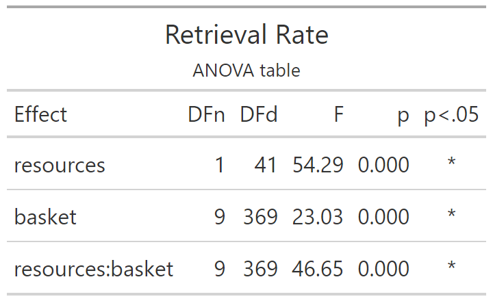
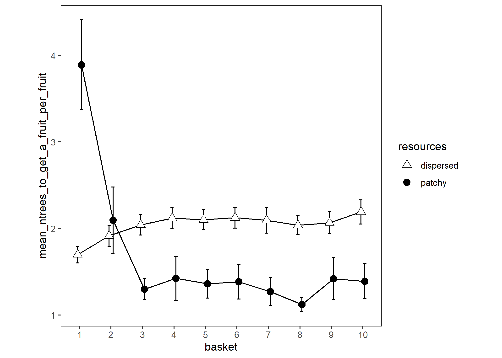

# Retrieval Rate

Experiment 1

```{r e1_retrievalrate_setup, include=FALSE}
knitr::opts_chunk$set(echo = FALSE)
knitr::opts_chunk$set(fig.path='e1_figures/')
knitr::opts_chunk$set(fig.width=7, fig.height=5)
options(dplyr.summarise.inform=F)
library(tidyverse)
library(ez)
library(gt)

e1 <- readRDS("001-00-e1-data.RDS")

# remove things from the raw data to make it suitable for this particular analysis

# remove samples that did not look at a tree
e1 <- e1 %>% 
  filter(fl>0)

# remove the second (and any subsequent) *consecutive* duplicates
e1 <- e1 %>% 
  filter(is.na(tl != lag(tl)) | tl != lag(tl))

# remove trials where they failed to get 10 fruit
e1 <- e1 %>% 
  group_by(pp, te) %>% 
  mutate(max_fr = max(fr)) %>% 
  ungroup() %>% 
  filter(max_fr==10)

e1_retrievalrate <-
  e1 %>%
  transmute(
    pid          = as_factor(pp),
    trial        = as.numeric(tb), # is 1 to 10 for each condition of "resources"
    resources    = factor(rr, levels=c("dispersed", "patchy"), labels=c("dispersed", "patchy")),
    stage        = as_factor(ifelse(trial<=5, "early", "late")),
    index        = ix,
    tree         = tl,
    flag         = fl,
    basket       = fr)

# how many trees to get each fruit?
# this is neat and it needs to be done after reducing the data to row-per-valid-tree-visit
e1_retrievalrate$ntrees_to_get_a_fruit = NA
j = 0
for (k in seq_along(e1_retrievalrate$index)) {
 j = j + 1
 if (e1_retrievalrate[k, 'flag']==2) {
   e1_retrievalrate[k, 'ntrees_to_get_a_fruit'] = j
   j = 0
 }
}


e1_retrievalrate_BASKET_VALUES <- 
  e1_retrievalrate %>% 
  group_by(pid, resources, trial, basket) %>% 
  summarise(
    ntrees_to_get_a_fruit = mean(ntrees_to_get_a_fruit, na.rm=TRUE)
    ) 

e1_retrievalrate_PARTICIPANT_MEANS <-
  e1_retrievalrate_BASKET_VALUES %>% 
  group_by(pid, resources, basket) %>% 
  summarise(mean_ntrees_to_get_a_fruit_per_fruit = mean(ntrees_to_get_a_fruit)) %>% 
  # remove NaNs for number of fruit of 0
  na.omit() %>% 
  # force basket to be a factor
  mutate(basket = as_factor(basket))

options(contrasts=c("contr.sum","contr.poly"))
e1_retrievalrate_ANOVA <- 
  ezANOVA(data=e1_retrievalrate_PARTICIPANT_MEANS,
          dv=mean_ntrees_to_get_a_fruit_per_fruit,
          wid=pid,
          within=c(resources,basket),
          type=3)

e1_retrievalrate_ANOVA_TABLE <-
  e1_retrievalrate_ANOVA$ANOVA %>% 
  select(-ges) %>% 
  gt() %>% 
  tab_header(
    title="Retrieval Rate",
    subtitle = "ANOVA table"
  ) %>% 
  fmt_number(
    columns = c("F"),
    rows=everything(),
    decimals=2
  )  %>% 
  fmt_number(
    columns = c("p"),
    rows=everything(),
    decimals=3
  ) %>% 
  cols_align(
    columns=`p<.05`,
    align="center"
  )
gtsave(e1_retrievalrate_ANOVA_TABLE, "e1_tables/e1_retrievalrate_ANOVA.png")

# Ten points along the x axis, each participant contributes one point per cell
e1_retrievalrate_PLOT10 <-
  ggplot(
  data=e1_retrievalrate_PARTICIPANT_MEANS, 
  aes(x=basket, y=mean_ntrees_to_get_a_fruit_per_fruit, group=resources, pch=resources, fill=resources)
) +
  theme_bw()+
  theme(aspect.ratio = 1, panel.grid=element_blank())+
  scale_fill_manual(values=c("white", "black")) +
  scale_shape_manual(values=c(24,19)) +
  stat_summary(fun.data = mean_cl_normal, geom = "errorbar", width=0.2, position=position_dodge(0.25)) +
  stat_summary(fun = mean, geom = "line", position=position_dodge(0.25)) + 
  stat_summary(fun = mean, geom = "point", size=3, position=position_dodge(0.25))
ggsave("e1_plots/e1_retrievalrate_PLOT10.png")
```

```{r out.width="50%"}

```

```{r out.width="75%"}

```

