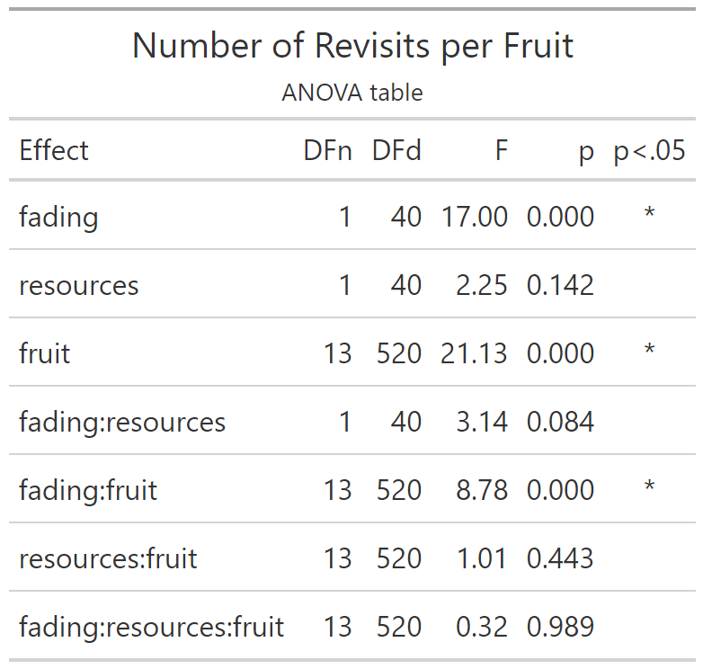
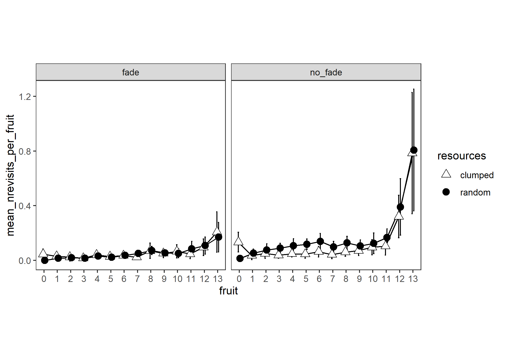

# Number of Revisits per Fruit

Experiment 2

```{r e2_nrevisitsperfruit_setup, include=FALSE}
knitr::opts_chunk$set(echo = FALSE)
knitr::opts_chunk$set(fig.path='e2_figures/')
knitr::opts_chunk$set(fig.width=7, fig.height=5)
options(dplyr.summarise.inform=F)
library(tidyverse)
library(ez)
library(gt)

e2 <- readRDS("fgms_e2_allsubs.rds")

e2_nrevisitsperfruit <-
  e2 %>%
  transmute(
    pid          = as_factor(pid),
    trial        = trial_in_block,
    resources    = R,
    fading       = V,
    index        = index,
    fruit        = basket,
    is_a_revisit   = revisit) %>%
  # number of revisits can't be greater than zero for the 14th fruit because we stop recording data as soon as they get to 14
  filter(fruit!=14) %>% 
  mutate(fruit=as_factor(fruit))

e2_nrevisitsperfruit_BASKET_VALUES <- 
  e2_nrevisitsperfruit %>% 
  group_by(pid, resources, fading, trial, fruit) %>% 
  summarise(nrevisits = sum(is_a_revisit))

e2_nrevisitsperfruit_PARTICIPANT_MEANS <-
  e2_nrevisitsperfruit_BASKET_VALUES %>% 
  group_by(pid, resources, fading, fruit) %>% 
  summarise(mean_nrevisits_per_fruit = mean(nrevisits))

options(contrasts=c("contr.sum","contr.poly"))
e2_nrevisitsperfruit_ANOVA <- 
  ezANOVA(data=e2_nrevisitsperfruit_PARTICIPANT_MEANS,
          dv=mean_nrevisits_per_fruit,
          wid=pid,
          within=c(resources,fruit),
          between=fading,
          type=3)

e2_nrevisitsperfruit_ANOVA_TABLE <-
  e2_nrevisitsperfruit_ANOVA$ANOVA %>% 
  select(-ges) %>% 
  gt() %>% 
  tab_header(
    title="Number of Revisits per Fruit",
    subtitle = "ANOVA table"
  ) %>% 
  fmt_number(
    columns = c("F"),
    rows=everything(),
    decimals=2
  )  %>% 
  fmt_number(
    columns = c("p"),
    rows=everything(),
    decimals=3
  ) %>% 
  cols_align(
    columns=`p<.05`,
    align="center"
  )
gtsave(e2_nrevisitsperfruit_ANOVA_TABLE, "e2_tables/e2_nrevisitsperfruit_ANOVA.png")

e2_nrevisitsperfruit_PLOT10 <-
  ggplot(data=e2_nrevisitsperfruit_PARTICIPANT_MEANS, aes(x=fruit, y=mean_nrevisits_per_fruit, group=resources, pch=resources, fill=resources))+
  theme_bw()+
  facet_wrap(~fading)+
  theme(aspect.ratio = 1, panel.grid=element_blank())+
  scale_fill_manual(values=c("white", "black")) +
  scale_shape_manual(values=c(24,19)) +
  stat_summary(fun.data = mean_cl_normal, geom = "errorbar", width=0.2, position=position_dodge(0.25)) +
  stat_summary(fun = mean, geom = "line", position=position_dodge(0.25)) + 
  stat_summary(fun = mean, geom = "point", size=3, position=position_dodge(0.25))
ggsave("e2_plots/e2_nrevisitsperfruit_PLOT10.png")
```

```{r out.width="50%"}

```

```{r out.width="100%"}

```

