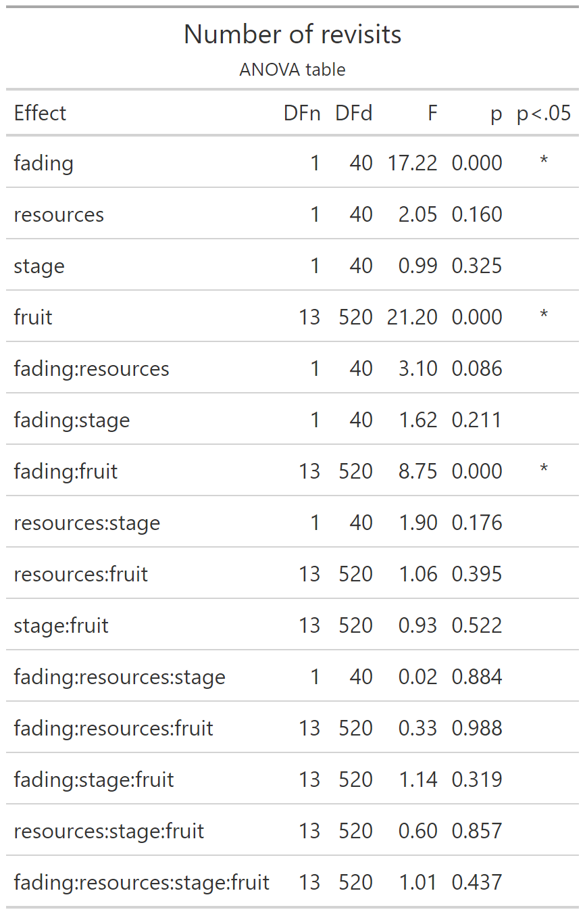

# Number of revisits grand analysis

Experiment 2

```{r e2_nrevisitsperfruit_setup, include=FALSE}
knitr::opts_chunk$set(echo = FALSE)
knitr::opts_chunk$set(fig.path='e2_figures/')
knitr::opts_chunk$set(fig.width=7, fig.height=5)
options(dplyr.summarise.inform=F)
library(tidyverse)
library(ez)
library(gt)

e2 <- readRDS("fgms_e2_allsubs.rds")
```


a 2 (fading) x 2 (resource distribution) x 2 (trial stage) x 14 (fruit consumed) analysis

```{r}
e2_nrevisits_grand <-
  e2 %>% 
  transmute(
    pid = pid,
    resources=R,
    fading=V,
    stage=ifelse(trial_in_block<=10, "early", "late"),
    trial=trial_in_block,
    index=index,
    fruit=basket,
    is_a_revisit=revisit) %>% 
  # number of revisits can't be greater than zero for the 14th fruit because we stop recording data as soon as they get to 14
  filter(
    fruit!=14
    ) %>% 
  mutate(
    fruit=as_factor(fruit),
    stage=as_factor(stage))
```

Currently this df has multiple rows for each fruit - we want a single row for each fruit representing the count of revisits for that fruit

```{r}
e2_nrevisits_grand_FRUIT_SUMS <-
  e2_nrevisits_grand %>% 
  group_by(pid, resources, fading, stage, trial, fruit) %>% 
  summarise(sumrevisits=sum(is_a_revisit))
```

Collapse over trials to get means per stage - a mean for each combination of participant and condition where condition is 2 (fading) x 2 (resources) x 2 (stage) x 14 (fruit)

```{r}
e2_nrevisits_grand_PARTICIPANT_MEANS <-
  e2_nrevisits_grand_FRUIT_SUMS %>% 
  group_by(pid, resources, fading, stage, fruit) %>% 
  summarise(meanrevisits=mean(sumrevisits)) %>% 
  ungroup()
```

```{r, eval=F, echo=TRUE}
#options(contrasts=c("contr.sum","contr.poly"))
#e2_nrevisits_grand_ANOVA <- 
#  ezANOVA(data=e2_nrevisits_grand_PARTICIPANT_MEANS,
#          dv=meanrevisits,
#          wid=pid,
#          within=c(resources,stage,fruit),
#          between=fading,
#          type=3)
```

That fails with

> Error in ezANOVA_main(data = data, dv = dv, wid = wid, within = within,  : 
  One or more cells is missing data. Try using ezDesign() to check your data.


```{r e2ezDesign_bad_nrevisitsgrand_plot1}
ezDesign(data=e2_nrevisits_grand_PARTICIPANT_MEANS,x=fruit,y=pid,row=resources,col=fading)
```

So every time (10 times) participant 3 saw a random trial in the late stage the first tree they looked at was a fruit, leaving them with no value for fruit of 0. This constitutes a structural missing.

```{r echo=TRUE}
# There is a value for early
subset(e2_nrevisits_grand_PARTICIPANT_MEANS, subset=pid==3 & resources=="random" & fading=="no_fade" & stage=="early" & fruit==0)
# but there isn't a value for late (this is a structural missing)
subset(e2_nrevisits_grand_PARTICIPANT_MEANS, subset=pid==3 & resources=="random" & fading=="no_fade" & stage=="late" & fruit==0)
```

One approach is to replace this missing value with zero.

Another approach would be to exclude that participant.

Another approach would be to exclude the first fruit from the analysis.

Our first attempt is to replace the structural missing with 0: after all, this is equivalent with saying that they didn't revisit any trees on their way to getting their first fruit, which is a true statement, even if it conceals that fact that they didn't have any _opportunities_ to revisit any trees on the way to getting their first fruit.

```{r e2ezDesign_bad_nrevisitsgrand_plot2}
add_me = e2_nrevisits_grand[1,]
add_me$pid=factor(3)
add_me$resources=factor("random")
add_me$fading=factor("no_fade")
add_me$stage=factor("late")
add_me$trial=NULL
add_me$index=NULL
add_me$is_a_revisit=NULL
add_me$meanrevisits=0
e2_nrevisits_grand_PARTICIPANT_MEANS <-
  e2_nrevisits_grand_PARTICIPANT_MEANS %>% 
  ungroup() %>% 
  bind_rows(add_me) %>% 
  arrange()
# check with this line:
# subset(e2_nrevisits_grand_PARTICIPANT_MEANS, subset=pid==3 & resources=="random" & stage=="late" & fruit==0)
ezDesign(data=e2_nrevisits_grand_PARTICIPANT_MEANS,x=fruit,y=pid,row=resources,col=fading)
```

Re-do the ANOVA (now without structural missing)

```{r e2nrevisitsanovatable, include=F}
options(contrasts=c("contr.sum","contr.poly"))
e2_nrevisits_grand_ANOVA <- 
  ezANOVA(data=e2_nrevisits_grand_PARTICIPANT_MEANS,
          dv=meanrevisits,
          wid=pid,
          within=c(resources,stage,fruit),
          between=fading,
          type=3)

e2_nrevisits_grand_ANOVA_TABLE <-
  e2_nrevisits_grand_ANOVA$ANOVA %>% 
  select(-ges) %>% 
  gt() %>% 
  tab_header(
    title="Number of revisits",
    subtitle = "ANOVA table"
  ) %>% 
  fmt_number(
    columns = c("F"),
    rows=everything(),
    decimals=2
  )  %>% 
  fmt_number(
    columns = c("p"),
    rows=everything(),
    decimals=3
  ) %>% 
  cols_align(
    columns=`p<.05`,
    align="center"
  )
gtsave(e2_nrevisits_grand_ANOVA_TABLE, "e2_tables/e2_nrevisits_grand_ANOVA.png")
```


```{r include=F}
e2_nrevisits_grand_PLOT10<-
ggplot(data=e2_nrevisits_grand_PARTICIPANT_MEANS, aes(x=fruit, y=meanrevisits, group=resources, pch=resources, fill=resources)) +
  facet_wrap(vars(stage,fading))+
  theme_bw()+
  theme(aspect.ratio = 1, panel.grid=element_blank())+
  scale_fill_manual(values=c("white", "black")) +
  scale_shape_manual(values=c(24,19)) +
  stat_summary(fun.data = mean_cl_normal, geom = "errorbar", width=0.2, position=position_dodge(0.25)) +
  stat_summary(fun = mean, geom = "line", position=position_dodge(0.25)) + 
  stat_summary(fun = mean, geom = "point", size=3, position=position_dodge(0.25))
ggsave("e2_plots/e2_nrevisits_grand_PLOT10.png")
```

```{r out.width="50%"}

```

```{r out.width="100%"}
knitr::include_graphics("e2_plots/e2_nrevisits_grand_PLOT10.png")
```

