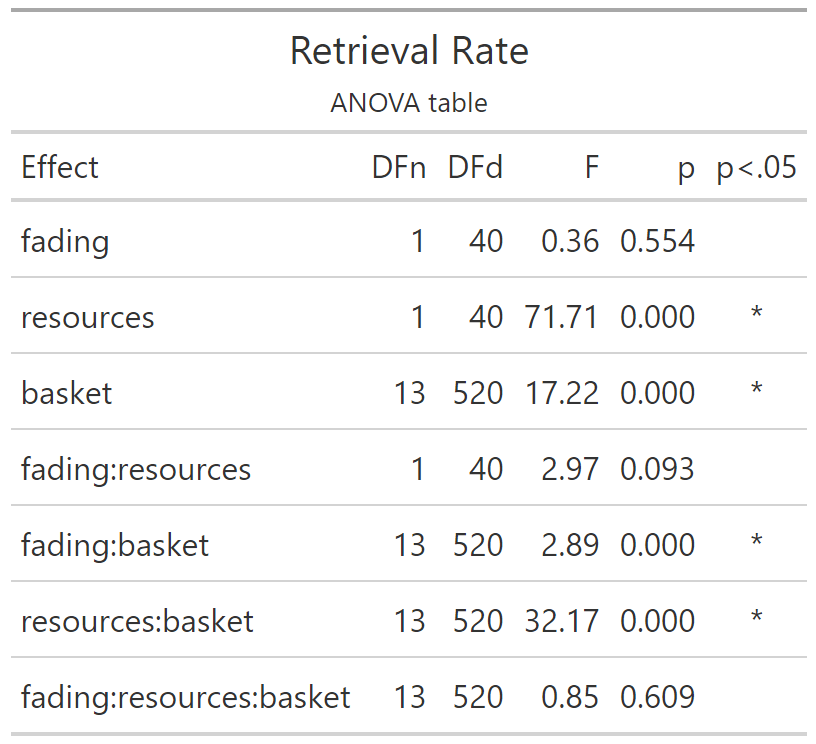
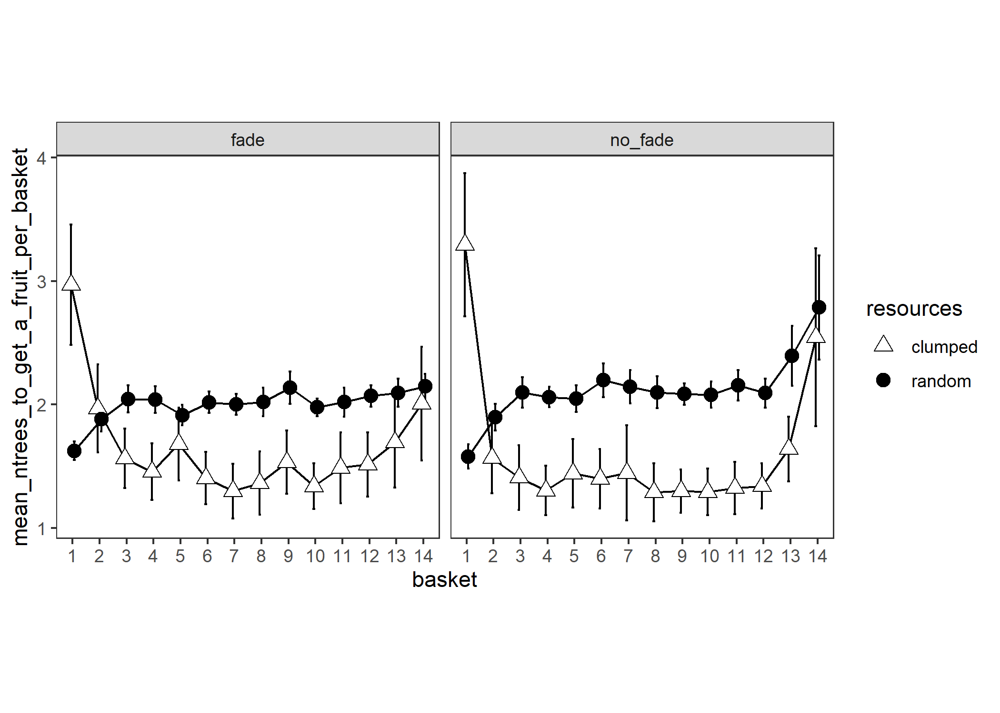

# Retrieval Rate

Experiment 2

```{r e2_retrievalrate_setup, include=FALSE}
knitr::opts_chunk$set(echo = FALSE)
knitr::opts_chunk$set(fig.path='e2_figures/')
knitr::opts_chunk$set(fig.width=7, fig.height=5)
options(dplyr.summarise.inform=F)
library(tidyverse)
library(ez)
library(gt)

e2 <- readRDS("fgms_e2_allsubs.rds")

e2_retrievalrate <-
  e2 %>%
  transmute(
    pid          = pid,
    trial        = trial_in_block,
    resources    = R,
    fading       = V,
    basket       = basket,
    index        = index,
    ntrees_to_get_a_fruit = ntreesperfruit)

e2_retrievalrate_BASKET_VALUES <- 
  e2_retrievalrate %>% 
  group_by(pid, resources, trial, fading, basket) %>% 
  summarise(
    ntrees_to_get_a_fruit = mean(ntrees_to_get_a_fruit, na.rm=TRUE)
    ) 

e2_retrievalrate_PARTICIPANT_MEANS <-
  e2_retrievalrate_BASKET_VALUES %>% 
  group_by(pid, resources, fading, basket) %>% 
  summarise(mean_ntrees_to_get_a_fruit_per_basket = mean(ntrees_to_get_a_fruit)) %>% 
  # remove NaNs for number of fruit of 0
  na.omit() %>% 
  # force basket to be a factor
  mutate(basket = as_factor(basket))

options(contrasts=c("contr.sum","contr.poly"))
e2_retrievalrate_ANOVA <- 
  ezANOVA(data=e2_retrievalrate_PARTICIPANT_MEANS,
          dv=mean_ntrees_to_get_a_fruit_per_basket,
          wid=pid,
          within=c(resources,basket),
          between=fading,
          type=3)

e2_retrievalrate_ANOVA_TABLE <-
  e2_retrievalrate_ANOVA$ANOVA %>% 
  select(-ges) %>% 
  gt() %>% 
  tab_header(
    title="Retrieval Rate",
    subtitle = "ANOVA table"
  ) %>% 
  fmt_number(
    columns = c("F"),
    rows=everything(),
    decimals=2
  )  %>% 
  fmt_number(
    columns = c("p"),
    rows=everything(),
    decimals=3
  ) %>% 
  cols_align(
    columns=`p<.05`,
    align="center"
  )
gtsave(e2_retrievalrate_ANOVA_TABLE, "e2_tables/e2_retrievalrate_ANOVA.png")


# 14 points along the x axis, each participant contributes one point per cell
e2_retrievalrate_PLOT14 <-
  ggplot(
  data=e2_retrievalrate_PARTICIPANT_MEANS, 
  aes(x=basket, y=mean_ntrees_to_get_a_fruit_per_basket, group=resources, pch=resources, fill=resources)
) +
  facet_wrap(~fading)+
  theme_bw()+
  theme(aspect.ratio = 1, panel.grid=element_blank())+
  scale_fill_manual(values=c("white", "black")) +
  scale_shape_manual(values=c(24,19)) +
  stat_summary(fun.data = mean_cl_normal, geom = "errorbar", width=0.2, position=position_dodge(0.25)) +
  stat_summary(fun = mean, geom = "line", position=position_dodge(0.25)) + 
  stat_summary(fun = mean, geom = "point", size=3, position=position_dodge(0.25))
ggsave("e2_plots/e2_retrievalrate_PLOT14.png")
```

```{r out.width="50%"}

```

```{r out.width="100%"}

```

Interaction between fading and basket

```{r dcheck_retrievalrate_interaction_basket_x_fading, out.width="100%"}
ggplot(data=e2_retrievalrate_PARTICIPANT_MEANS %>% group_by(basket,fading,pid) %>% summarise(mean_ntrees_to_get_a_fruit_per_basket2=mean(mean_ntrees_to_get_a_fruit_per_basket)),
       aes(x=basket,y=mean_ntrees_to_get_a_fruit_per_basket2,group=fading,pch=fading))+
  #facet_wrap(~fading)+
  theme_bw()+
  theme(aspect.ratio = 1, panel.grid=element_blank())+
  scale_fill_manual(values=c("white", "black")) +
  scale_shape_manual(values=c(24,19))+
  stat_summary(fun.data = mean_cl_normal, geom = "errorbar", width=0.2, position=position_dodge(0.25)) +
  stat_summary(fun = mean, geom = "line", position=position_dodge(0.25)) + 
  stat_summary(fun = mean, geom = "point", size=3, position=position_dodge(0.25))
```

