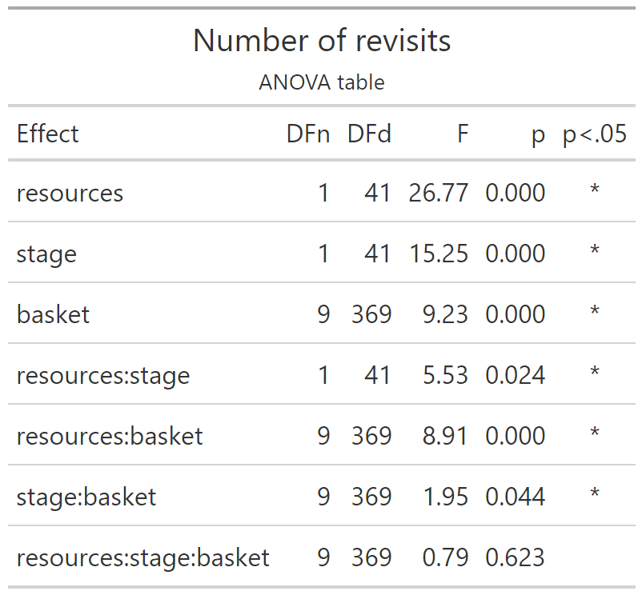
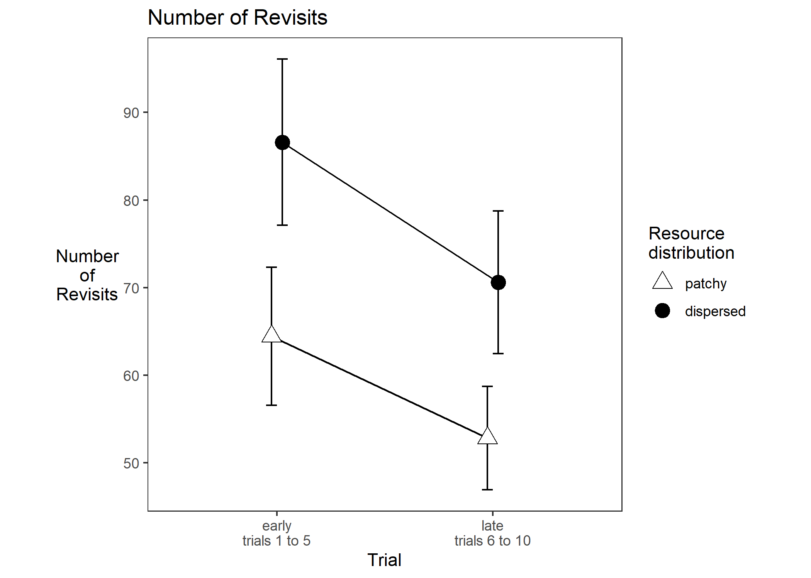
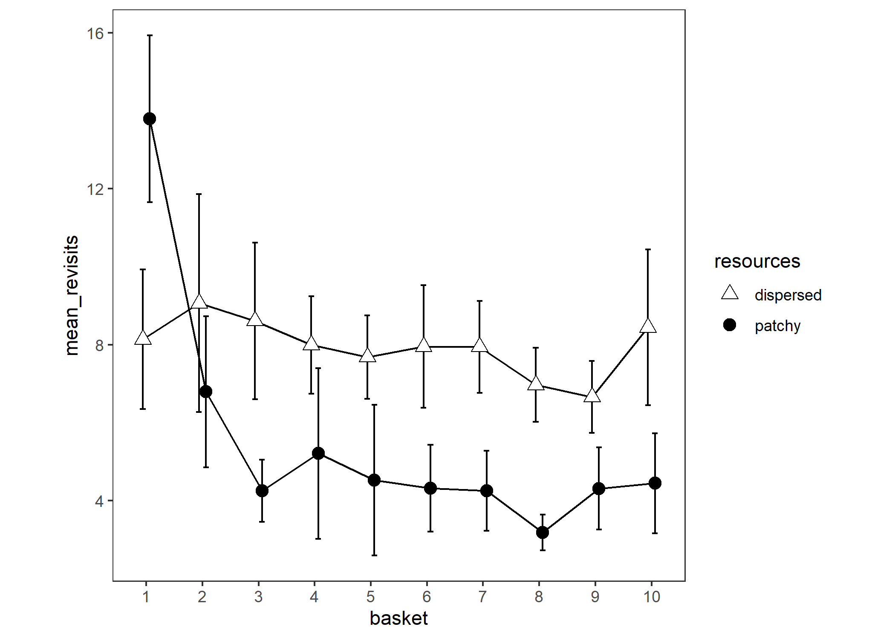
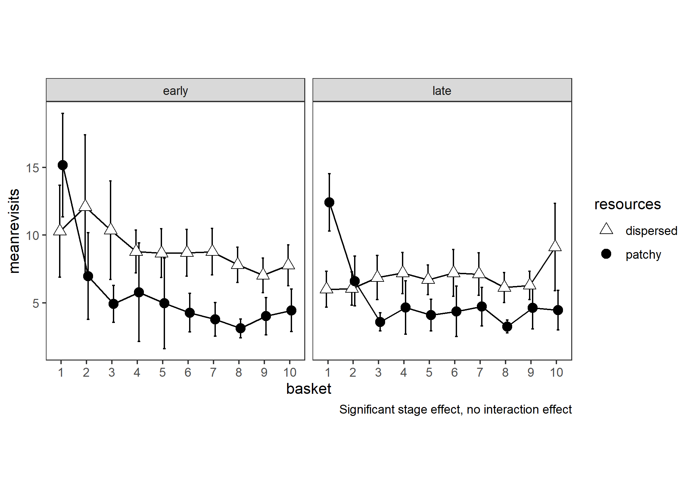

# Number of revisits grand analysis

Experiment 1


This is a 2 (resource distribution) x 2 (trial stage) x 10 (sequential fruit consumed) analysis.

## Form the dataset


```r
e1_revisits_df <-
  e1 %>% 
  transmute(
    pp = as_factor(pp),
    trial = as.numeric(tb), # ranges 1 to 10
    resources = rr,
    stage = ifelse(trial<=5,"early","late"),
    basket = fr,
    sample = ix,
    tree = tl)

e1_revisits_df <- e1_revisits_df %>% 
  mutate(revisit = as.numeric(duplicated(tree))) %>% 
  mutate(
    # "is_a" to remind us that the raw data are binary yes/no 
    # for whether the current visit is a revisit or not
    is_a_revisit = as.logical(revisit)
    ) %>% 
  # number of revisits can't be greater than zero for the 10th fruit 
  # because we stop recording data as soon as they get to 10
  # so we remove those values because they must have no variance
  # and it would distort the analysis to treat those zeros as meaningful.
  filter(
    basket < 10
    ) %>% 
  # basket+1 because the data were recorded such that this 
  # tally is zero until they get a fruit but we want to say 
  # that they had a certain number of revisits while they 
  # were searching for the first fruit, not while they 
  # had zero fruit in their basket
  mutate(
   basket = basket +1 
  ) %>% 
  # set factors
  mutate(
    trial = as_factor(trial),
    stage = as_factor(stage),
    tree = as_factor(tree),
    basket = as_factor(basket),
    resources = as_factor(resources)
    ) 
```


```r
gt(subset(e1_revisits_df, pp==1&trial==1&resources=="clumped"))
```

```{=html}
<div id="twpvevgiym" style="padding-left:0px;padding-right:0px;padding-top:10px;padding-bottom:10px;overflow-x:auto;overflow-y:auto;width:auto;height:auto;">
<style>html {
  font-family: -apple-system, BlinkMacSystemFont, 'Segoe UI', Roboto, Oxygen, Ubuntu, Cantarell, 'Helvetica Neue', 'Fira Sans', 'Droid Sans', Arial, sans-serif;
}

#twpvevgiym .gt_table {
  display: table;
  border-collapse: collapse;
  margin-left: auto;
  margin-right: auto;
  color: #333333;
  font-size: 16px;
  font-weight: normal;
  font-style: normal;
  background-color: #FFFFFF;
  width: auto;
  border-top-style: solid;
  border-top-width: 2px;
  border-top-color: #A8A8A8;
  border-right-style: none;
  border-right-width: 2px;
  border-right-color: #D3D3D3;
  border-bottom-style: solid;
  border-bottom-width: 2px;
  border-bottom-color: #A8A8A8;
  border-left-style: none;
  border-left-width: 2px;
  border-left-color: #D3D3D3;
}

#twpvevgiym .gt_heading {
  background-color: #FFFFFF;
  text-align: center;
  border-bottom-color: #FFFFFF;
  border-left-style: none;
  border-left-width: 1px;
  border-left-color: #D3D3D3;
  border-right-style: none;
  border-right-width: 1px;
  border-right-color: #D3D3D3;
}

#twpvevgiym .gt_caption {
  padding-top: 4px;
  padding-bottom: 4px;
}

#twpvevgiym .gt_title {
  color: #333333;
  font-size: 125%;
  font-weight: initial;
  padding-top: 4px;
  padding-bottom: 4px;
  padding-left: 5px;
  padding-right: 5px;
  border-bottom-color: #FFFFFF;
  border-bottom-width: 0;
}

#twpvevgiym .gt_subtitle {
  color: #333333;
  font-size: 85%;
  font-weight: initial;
  padding-top: 0;
  padding-bottom: 6px;
  padding-left: 5px;
  padding-right: 5px;
  border-top-color: #FFFFFF;
  border-top-width: 0;
}

#twpvevgiym .gt_bottom_border {
  border-bottom-style: solid;
  border-bottom-width: 2px;
  border-bottom-color: #D3D3D3;
}

#twpvevgiym .gt_col_headings {
  border-top-style: solid;
  border-top-width: 2px;
  border-top-color: #D3D3D3;
  border-bottom-style: solid;
  border-bottom-width: 2px;
  border-bottom-color: #D3D3D3;
  border-left-style: none;
  border-left-width: 1px;
  border-left-color: #D3D3D3;
  border-right-style: none;
  border-right-width: 1px;
  border-right-color: #D3D3D3;
}

#twpvevgiym .gt_col_heading {
  color: #333333;
  background-color: #FFFFFF;
  font-size: 100%;
  font-weight: normal;
  text-transform: inherit;
  border-left-style: none;
  border-left-width: 1px;
  border-left-color: #D3D3D3;
  border-right-style: none;
  border-right-width: 1px;
  border-right-color: #D3D3D3;
  vertical-align: bottom;
  padding-top: 5px;
  padding-bottom: 6px;
  padding-left: 5px;
  padding-right: 5px;
  overflow-x: hidden;
}

#twpvevgiym .gt_column_spanner_outer {
  color: #333333;
  background-color: #FFFFFF;
  font-size: 100%;
  font-weight: normal;
  text-transform: inherit;
  padding-top: 0;
  padding-bottom: 0;
  padding-left: 4px;
  padding-right: 4px;
}

#twpvevgiym .gt_column_spanner_outer:first-child {
  padding-left: 0;
}

#twpvevgiym .gt_column_spanner_outer:last-child {
  padding-right: 0;
}

#twpvevgiym .gt_column_spanner {
  border-bottom-style: solid;
  border-bottom-width: 2px;
  border-bottom-color: #D3D3D3;
  vertical-align: bottom;
  padding-top: 5px;
  padding-bottom: 5px;
  overflow-x: hidden;
  display: inline-block;
  width: 100%;
}

#twpvevgiym .gt_group_heading {
  padding-top: 8px;
  padding-bottom: 8px;
  padding-left: 5px;
  padding-right: 5px;
  color: #333333;
  background-color: #FFFFFF;
  font-size: 100%;
  font-weight: initial;
  text-transform: inherit;
  border-top-style: solid;
  border-top-width: 2px;
  border-top-color: #D3D3D3;
  border-bottom-style: solid;
  border-bottom-width: 2px;
  border-bottom-color: #D3D3D3;
  border-left-style: none;
  border-left-width: 1px;
  border-left-color: #D3D3D3;
  border-right-style: none;
  border-right-width: 1px;
  border-right-color: #D3D3D3;
  vertical-align: middle;
  text-align: left;
}

#twpvevgiym .gt_empty_group_heading {
  padding: 0.5px;
  color: #333333;
  background-color: #FFFFFF;
  font-size: 100%;
  font-weight: initial;
  border-top-style: solid;
  border-top-width: 2px;
  border-top-color: #D3D3D3;
  border-bottom-style: solid;
  border-bottom-width: 2px;
  border-bottom-color: #D3D3D3;
  vertical-align: middle;
}

#twpvevgiym .gt_from_md > :first-child {
  margin-top: 0;
}

#twpvevgiym .gt_from_md > :last-child {
  margin-bottom: 0;
}

#twpvevgiym .gt_row {
  padding-top: 8px;
  padding-bottom: 8px;
  padding-left: 5px;
  padding-right: 5px;
  margin: 10px;
  border-top-style: solid;
  border-top-width: 1px;
  border-top-color: #D3D3D3;
  border-left-style: none;
  border-left-width: 1px;
  border-left-color: #D3D3D3;
  border-right-style: none;
  border-right-width: 1px;
  border-right-color: #D3D3D3;
  vertical-align: middle;
  overflow-x: hidden;
}

#twpvevgiym .gt_stub {
  color: #333333;
  background-color: #FFFFFF;
  font-size: 100%;
  font-weight: initial;
  text-transform: inherit;
  border-right-style: solid;
  border-right-width: 2px;
  border-right-color: #D3D3D3;
  padding-left: 5px;
  padding-right: 5px;
}

#twpvevgiym .gt_stub_row_group {
  color: #333333;
  background-color: #FFFFFF;
  font-size: 100%;
  font-weight: initial;
  text-transform: inherit;
  border-right-style: solid;
  border-right-width: 2px;
  border-right-color: #D3D3D3;
  padding-left: 5px;
  padding-right: 5px;
  vertical-align: top;
}

#twpvevgiym .gt_row_group_first td {
  border-top-width: 2px;
}

#twpvevgiym .gt_summary_row {
  color: #333333;
  background-color: #FFFFFF;
  text-transform: inherit;
  padding-top: 8px;
  padding-bottom: 8px;
  padding-left: 5px;
  padding-right: 5px;
}

#twpvevgiym .gt_first_summary_row {
  border-top-style: solid;
  border-top-color: #D3D3D3;
}

#twpvevgiym .gt_first_summary_row.thick {
  border-top-width: 2px;
}

#twpvevgiym .gt_last_summary_row {
  padding-top: 8px;
  padding-bottom: 8px;
  padding-left: 5px;
  padding-right: 5px;
  border-bottom-style: solid;
  border-bottom-width: 2px;
  border-bottom-color: #D3D3D3;
}

#twpvevgiym .gt_grand_summary_row {
  color: #333333;
  background-color: #FFFFFF;
  text-transform: inherit;
  padding-top: 8px;
  padding-bottom: 8px;
  padding-left: 5px;
  padding-right: 5px;
}

#twpvevgiym .gt_first_grand_summary_row {
  padding-top: 8px;
  padding-bottom: 8px;
  padding-left: 5px;
  padding-right: 5px;
  border-top-style: double;
  border-top-width: 6px;
  border-top-color: #D3D3D3;
}

#twpvevgiym .gt_striped {
  background-color: rgba(128, 128, 128, 0.05);
}

#twpvevgiym .gt_table_body {
  border-top-style: solid;
  border-top-width: 2px;
  border-top-color: #D3D3D3;
  border-bottom-style: solid;
  border-bottom-width: 2px;
  border-bottom-color: #D3D3D3;
}

#twpvevgiym .gt_footnotes {
  color: #333333;
  background-color: #FFFFFF;
  border-bottom-style: none;
  border-bottom-width: 2px;
  border-bottom-color: #D3D3D3;
  border-left-style: none;
  border-left-width: 2px;
  border-left-color: #D3D3D3;
  border-right-style: none;
  border-right-width: 2px;
  border-right-color: #D3D3D3;
}

#twpvevgiym .gt_footnote {
  margin: 0px;
  font-size: 90%;
  padding-left: 4px;
  padding-right: 4px;
  padding-left: 5px;
  padding-right: 5px;
}

#twpvevgiym .gt_sourcenotes {
  color: #333333;
  background-color: #FFFFFF;
  border-bottom-style: none;
  border-bottom-width: 2px;
  border-bottom-color: #D3D3D3;
  border-left-style: none;
  border-left-width: 2px;
  border-left-color: #D3D3D3;
  border-right-style: none;
  border-right-width: 2px;
  border-right-color: #D3D3D3;
}

#twpvevgiym .gt_sourcenote {
  font-size: 90%;
  padding-top: 4px;
  padding-bottom: 4px;
  padding-left: 5px;
  padding-right: 5px;
}

#twpvevgiym .gt_left {
  text-align: left;
}

#twpvevgiym .gt_center {
  text-align: center;
}

#twpvevgiym .gt_right {
  text-align: right;
  font-variant-numeric: tabular-nums;
}

#twpvevgiym .gt_font_normal {
  font-weight: normal;
}

#twpvevgiym .gt_font_bold {
  font-weight: bold;
}

#twpvevgiym .gt_font_italic {
  font-style: italic;
}

#twpvevgiym .gt_super {
  font-size: 65%;
}

#twpvevgiym .gt_footnote_marks {
  font-style: italic;
  font-weight: normal;
  font-size: 75%;
  vertical-align: 0.4em;
}

#twpvevgiym .gt_asterisk {
  font-size: 100%;
  vertical-align: 0;
}

#twpvevgiym .gt_indent_1 {
  text-indent: 5px;
}

#twpvevgiym .gt_indent_2 {
  text-indent: 10px;
}

#twpvevgiym .gt_indent_3 {
  text-indent: 15px;
}

#twpvevgiym .gt_indent_4 {
  text-indent: 20px;
}

#twpvevgiym .gt_indent_5 {
  text-indent: 25px;
}
</style>
<table class="gt_table">
  
  <thead class="gt_col_headings">
    <tr>
      <th class="gt_col_heading gt_columns_bottom_border gt_center" rowspan="1" colspan="1" scope="col" id="pp">pp</th>
      <th class="gt_col_heading gt_columns_bottom_border gt_center" rowspan="1" colspan="1" scope="col" id="trial">trial</th>
      <th class="gt_col_heading gt_columns_bottom_border gt_center" rowspan="1" colspan="1" scope="col" id="resources">resources</th>
      <th class="gt_col_heading gt_columns_bottom_border gt_center" rowspan="1" colspan="1" scope="col" id="stage">stage</th>
      <th class="gt_col_heading gt_columns_bottom_border gt_center" rowspan="1" colspan="1" scope="col" id="basket">basket</th>
      <th class="gt_col_heading gt_columns_bottom_border gt_right" rowspan="1" colspan="1" scope="col" id="sample">sample</th>
      <th class="gt_col_heading gt_columns_bottom_border gt_center" rowspan="1" colspan="1" scope="col" id="tree">tree</th>
      <th class="gt_col_heading gt_columns_bottom_border gt_right" rowspan="1" colspan="1" scope="col" id="revisit">revisit</th>
      <th class="gt_col_heading gt_columns_bottom_border gt_center" rowspan="1" colspan="1" scope="col" id="is_a_revisit">is_a_revisit</th>
    </tr>
  </thead>
  <tbody class="gt_table_body"></tbody>
  
  
</table>
</div>
```

## First round of aggregation

When someone visits more than one tree to get the next fruit, there is more than one row for that basket. Because we intend to turn the logical `is_a_revisit` into a count of revisits broken down by trial and basket, we want to turn those multiple rows into one row, and add up any revisits that took place in those multiple rows so that all the single rows in the new df will now represent a count of revisits for the cell of the design that is represented in that row, and no cell of the design will have more than one row.


```r
e1_revisits_df_agg1 <-
  e1_revisits_df %>% 
  group_by(pp,trial,stage,resources,basket) %>% 
  summarise(sum_of_revisits = sum(is_a_revisit))
```

## Structural missings treatment

It turns out that if the first tree the participant visited contained a fruit that they consumed then `is_a_revisit` doesn't get recorded as FALSE for the first tree. That means that there are structural missings in the data for each time that occurred. The ANOVA fails if there exists a cell of the design that is made up of structural missings - which happens if someone consumed a fruit on the first tree they looked at for all the trials that go into that cell of the ANOVA. This was the case for: participant 17 in clumped; and participants 37, 20, 12, 6 in random. We decided to manually add rows with zero `sum_of_revisit`s for these cases.

We know that we excluded trials on which participants did not collect at least ten fruit (in the code that read in the individual pickles that is executed to yield the starting data in this script). 

If we make a data frame that represents the complete design structure for the participants and trials that are present in the current data, and merge it with the current data, supplying values for the non-matching cells, we will end up with a data frame that will succeed at the stage where it is submitted to ANOVA.


```r
e1_revisits_df_agg2 <-
  expand.grid(
    basket=1:10,
    trial=c(1:10,1:10),
    pp=unique(e1_revisits_df_agg1$pp)
    ) %>% # is 8400
  mutate(
    stage=ifelse(trial<=5,"early","late") 
    ) %>% 
  bind_cols(
    resources=as_factor(rep(c("dispersed","patchy"),each=10,times=420))
    ) %>% 
  select(
    pp,trial,stage,resources,basket
    ) %>% 
  mutate(
    trial=as_factor(trial),
    stage=as_factor(stage),
    resources=as_factor(resources),
    basket=as_factor(basket)
    ) %>% 
  as_tibble() %>% 
  left_join(
    y = e1_revisits_df_agg1,
    by = c("pp", "trial", "stage", "resources", "basket")
    ) %>% 
  replace_na(list(sum_of_revisits=0))
```

Collapse over trials to get means per stage - each participant contributes one value per cell where a cell is 2 (resources) x 2 (stage) x 10 (fruit).


```r
e1_nrevisits_grand_PARTICIPANT_MEANS <-
  e1_revisits_df_agg2 %>% 
  group_by(pp, resources, stage, basket) %>% 
  summarise(meanrevisits=mean(sum_of_revisits))
```

ANOVA now


This is the ANOVA table


```r

```


----

## Means

### Significant stage effect means

Now we want grand means for the significant stage effect.


```r
# we want one value from each participant for early and one value from each participant for late, = stage means for the body text
stagemeansPerParticipant <- 
  e1_revisits_df %>% 
  ungroup() %>% 
  select(pp, trial, stage, is_a_revisit) %>% 
  # get count for each trial
  group_by(pp, trial, stage) %>% 
  summarise(count_revisits_for_trial=sum(is_a_revisit)) %>% 
  # aggregate trial counts to get a single value for each stage from each participant
  group_by(pp,stage) %>% 
  summarise(mean_revisits=mean(count_revisits_for_trial))

stageGrandMeans <- # these are for the body text
  stagemeansPerParticipant %>% 
  group_by(stage) %>% 
  summarise(mean=mean(mean_revisits), sd=sd(mean_revisits))
stageGrandMeans
#> # A tibble: 2 × 3
#>   stage  mean    sd
#>   <fct> <dbl> <dbl>
#> 1 early  151.  40.7
#> 2 late   123.  38.2
#stageGrandMeans %>% 
#  gt() %>% fmt_number(c(2,3), everything(), 2) %>% tab_options(table.align='left')
```


### Significant fruit effect means

We report the first and tenth value


```r
fruitmeansPerParticipant <-
  e1_revisits_df %>% 
  # get sum of the revisits on a trial
  ungroup() %>% 
  select(pp, trial, basket, is_a_revisit) %>% 
  group_by(pp, trial, basket) %>% 
  summarise(count_revisits=sum(is_a_revisit)) %>% 
  # aggregate over trials - average n revisits for each participant at each fruit consumption
  group_by(pp, basket) %>% 
  summarise(mean_revisits=mean(count_revisits)) %>% 
  # take it down to ten rows one for each fruit averaging over participants
  group_by(basket) %>% 
  summarise(mean=mean(mean_revisits), sd=sd(mean_revisits))
fruitmeansPerParticipant
#> # A tibble: 10 × 3
#>    basket  mean    sd
#>    <fct>  <dbl> <dbl>
#>  1 1       22.2  7.17
#>  2 2       16.7  9.84
#>  3 3       13.2  6.26
#>  4 4       13.1  5.63
#>  5 5       11.9  4.41
#>  6 6       12.3  5.65
#>  7 7       12.0  3.80
#>  8 8       11.0  3.78
#>  9 9       12.5  5.98
#> 10 10      12.4  5.75
#gt(fruitmeansPerParticipant) %>% fmt_number(c(2,3), everything(), 2) %>% tab_options(table.align='left')
```

The average number of revisits made while searching for the first fruit item was 
22.23 +/- 7.17. 
The average number of revisits made while searching for the last fruit item was 
12.42 +/- 5.75. 

----

## Interaction plots

### Stage x Resources

We write code for the plot of the stage x resources interaction. The stage effect is significant but the interaction isn't.


```r

```


----


### Resources x Fruit interaction (SIG)

Now averaging over stage to give a plot of the (significant) resources X fruit interaction: we will use this in the paper


```r

```


----


### 3-way stage x fruit x resources

We write code for the stage x fruit x resources interaction. This 3-way interaction is not sig so we don't use this plot - instead we separately plot the significant 2-way resource x fruit collapsing over resources.


```r

```


